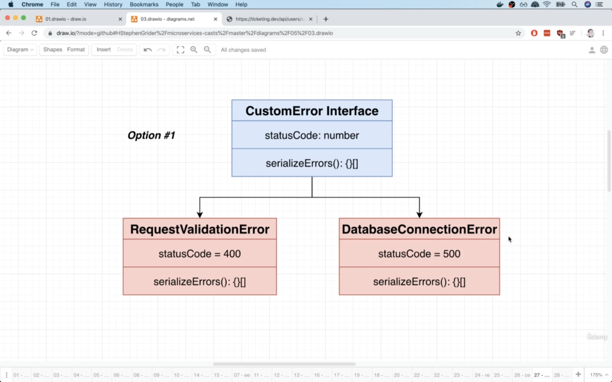

# 07 - Response Normalization Strategies

## 128-001 Creating Route Handlers:
Look at 128-001-1. Each route handler gets it's own separate file.

In the route files, we're gonna set up a router, which is an object that we can use to associate routes with and then at the very bottom,
we're gonna export that router and rename it at the same time. The reason we are renaming that export with the `as` keyword, is that we're going to
end up with many different routers inside of our app. So they can't all be called router.

We COULD just export a function that receives the req and res and next and error and then associate those functions with our app back in the index.ts file.

## 129-002 Scaffolding Routes:

## 130-003 Adding Validation:
When we have const {email, password} = req.body; in a route handler, we're ASSUMING 100% that there's going to be an email and password on the body.
So we're assuming that email and password are actually DEFINED and they actually CONTAIN an email and password. It's possible that a user send us some
malicious req or even just a faulty request(one that doesn't include an email or password in the body of req). 

**Note:** So we don't want any code that's just going to **assume** that a user is providing the right stuff as expected.

We're gonna use **express-validator**.

Validation is the process of making sure that information has the correct structure and form, whereas sanitization is going to **change** that information is some
way. So it might try to remove certain types of characters or ... .

When we install a new package, the package.json is gonna change. Skaffold is watching all the files inside of our project directory and as soon as it 
sees a change to a **non-synced** file(like package.json file), that's going to decide to automatically rebuild our image and then update the associated deployment and
then we can see the updated pod.

With express-validator, in addition to validation and sanitization on body, we can do those on url params and url search params.

In express-validator, trim() is a sanitization step that's gonna make sure that there are no lodaing or trailing spaces on that field.

The withMessage() in the password field, is gonna popup in case the password is not present or doesn't have that supplied length.

As soon as we added in that array for those express-validator middleware, we got some errors on req and res. Add some type annotations to those
two.

Now we need to actually consuming that info coming out of validation. In other words, we never seem to take any actual errors that might coming out of that validation
step and sending them back to the users.

## 131-004 Handling Validation Errors
Currently, we're doing some validation, but we're not actually communicating the results of that validation back to the user.
In the validation step(where we have an array of express validator functions), if there's anything wrong with the fields, those functions(like body()) are
going to append some properties onto that req object. So we use the validationResult function to pull that validation information off.

For testing signup route, make sure you have a Content-Type: application/json in the headers and in the body tab, make sure it's in the JSON format.

## 132-005 Postman HTTPS Issues:
Hi!

Got an error when testing the route handler in the last video? If so, do the following:

Open the Postman preferences. On MacOS, the hot key for this is CMD + ,

Find the setting called SSL certificate verification

Change this setting to off, as shown in the screenshot below

Look at 132-005-1.

## 133-006 Surprising Complexity Around Errors:
Look at 133-006-1.

Currently, we're not following a standard. We're using express-validator and it doesn't follow a standard.
Look at 133-006-2.

Now the reason that that is relevant, is that we're in a microservices architecture and remember at some point we would have many other services.
The other thing that's really relevant is that these other services could be built using completely different languages and frameworks.

Chances are that if we ever have our react app submit some invalid data to a ruby on rails app, the ruby on rails app is probably gonna give back some 
response that looks very different than the one that we just got back from express-validator response.

In a microservices environment where we're going to have multiple different languages, multiple different frameworks running on all those different services.
Whenever we submit some invalid data to these different services, we're gonna get back a error response that might have a very different looking STRUCTURE.

This is a huge problem. Because we're assuming that all these very different response strcutures are going to be going back to the same exact react app.
So inside of our react app, we're gonna have to encode the knowledge of how to work with these different kinds of error responses.
The react app is going have to know that if it is making a req to the auth service, it should expect a error response that looks like the one in digaram.
The react app will also have to know what if it is making a req to the orders service, it should expect a response that looks like that one.

So the engineers of front end app are going to have to have a very in-depth knowledge of exactly what kind of error structure they're going to get back from
each of those very particular services and that's not a responsibility that we want to throw on engineers that are building the react app.

**Note:** We need to be sure that every single service is going to send back a identical looking structure, anytime there is some error that occurs.

## 134-007 Other Sources of Errors:
We need to make sure that we've got a consistent structure for every kind of error response we ever expect to send back from any service.

In 134-007-1, we're saying we have no idea WHERE sth is going to go wrong inside our app. We might have sth go wrong from express-validator, it might go wrong
during some internal validation and it might go wrong even at the database access level and in all these different scenarios, we need to somehow capture
these errors as they are occurring and send back that identical looking structure. 


## 135-008 Solution for Error Handling:
Look at 135-008-1 and 135-008-2.

If we have a middleware function with **4 args**, express is gonna assume that this is a function meant to handle errors that can occur.

## 136-009 Building an Error Handling Middleware:
Create a folder called middlewares and then create a file named error-handler.ts .

The #1 goal inside that error handler is to make sure that we always send back a very consistently structured message. Because again, we do not want our
react app to have to be trying to figure out exactly how to handle all these 30 or ... different kinds of errors.

We have multiple places where our code can fail, multiple places where we can throw errors and no matter what, we're always capturing those errors, thanks to
the fact that express is gonna automatically capture any error that we throw inside of a route handler and throw it off to our error handling middleware.

## 137-010 Communicating More Info to the Error Handler:
**Note:** Whenever we create a new Error and throw it, whatever string we provide as the first arg to that Error constructor, is assigned to the `message` property
of the error.

Look at 137-010-1.

We can communicate a lot of info from our req handler(controller) to our error handling middleware, by attaching that info to the Error object in some way.
Right now, we're really just limited to that message property. In other words, we're limited to a simple string. Ideally, we would send back a lot more info
to the user than just that simple string.

Look at 137-010-2.

If we were in JS land, we could say:
```js
const error = new Error('...');
error.reasons = errors; // create a new property on error object and attach the result of validationResult() which we named it errors in this case.
throw error;
```
then we can access that reasons property inside the error handler and use it there to send back a good structured error response.

So this is ideal, this would give us the ability to share a lot more info about what just went wrong with the user, compared to what we have right now,
which is only to send a string to the error handler.

But in TS. we can't just assign magic properties made up on the fly(like reasons) to any old object that we want to assign stuff to.
An Error type, in ts and js doesn't have a reasons property. So ts is gonna throw error.

We need to somehow communicate a lot more info from the req handler to the error handler, we have to do it using the Error object, but we cannot really use 
this simple approach which is creating on the fly properties.

## 138-011 Encoding More Information In an Error:
Here's what we want to do:(Look at 138-011-1).

Anytime you say you want sth like X, but you want to add in some more custom properties, that is usually a sign that you want to subclass sth.

We're gonna take the built-in Error object and subclass it into two separate sub-classes. Look at 138-011-2.

The reason that we're making both these subclasses, is that when we create the subclass, we can add in some additional custom properties to it that will
further clarify the reason for the error. Again, we're trying to use these custom subclasses to communicate much more info from the req handler to that
error handling middleware.

Look at 138-011-3. First we start off that the top(request handler section). 

## 139-012 Subclassing for Custom Errors:
Inside src, create a new folder called `errors` and there, we're gonna write the different custom subclasses of Error.

In the constructor of RequestValidationError, we're using the keyword `private`, because we want to take that property(actually argument) and assign it as a property to the 
overall class. So writing out the private keyword in the () of constructor, is equivalent of:
```typescript
class A {
    constructor(private errors: ValidationError[]) {}
}

// is equivalent to:
class A {
    private errors: ValidationError[];
    
    constructor(errors: ValidationError[]) {
        this.errors = errors;
    }
}
```

When we extend a base class, we have to call super to invoke the constructor of the base class and pass necessary args for constructing that base class to super() .

**Note:** When we're using TS and extending a **BUILT-IN** class to the language, we need to write this line after calling super():
```ts
// only because we're extending a built in class:
Object.setPrototypeOf(this, <current class>.prototype);
```
This is just some behind the scenes stuff that gets our new custom class that is extending the base class to work correctly(the reason is that
we're extending a built-in class).

We're only using a string to communicate the reason of error(the only thing we care is a string) in the DatabaseConnectionError, so we COULD not create it and instead
only use the builtin Error. Tutor just wanted to give us kind of a counterpoint.

So now use those custom errors instead of the generic builtin Error in the request handlers.

So the step 1 of error handling is done which is we're throwing the custom errors out of the request handlers and they're gonna eventually show up inside
of our error handling middleware and there we inspect the incoming error and check to see if it is an instance of those custom errors and send back an appropriate
response.

## 140-013 Determining Error Type:
By checking the err inside the error handling middleware with instanceof, that means that we can tell our error handling middleware how to run some custom logic depending
upon the type of error that it is receiving.

## 141-014 Converting Errors to Responses:
Our error handling middleware is now aware of the type of error that it is dealing with. So now we need to inspect each of those different errors, 
somehow formulate a response and send it back to the user.

The entire reason we got into this discussion was we wanted to make sure that all those different services and all those different kinds of errors are
always gonna result in the exact same structure of error.

So we don't want sth like the 141-014-1 diagram!

The 141-014-2 diagram shows the common response structure for all errors we have inside our app. So no matter the server that it is coming from, we're ALWAYS
gonna send back an object that has an errors property and inside there, it's gonna be an array of objects and each of those objects will have a message and optionally a 
field that refers to what this error is tied to?

## 142-015 Moving Logic Into Errors:
There's sth not so great about current implementation of our error handling middleware:
Right now, we're throwing our RequestValidationError and the DatabaseConnectionError into that error handling middleawre and we've encoded inside there some
very intricate knowledge of exactly how to extract info from every kind of error that exists inside our app(at present there are 2 kinds of errors in addition to
the case where there is some not known error).

Let's imagine we have 10 kinds of custom errors for everything that can go wrong. We need to handle all of them in error handling middleware! It needs to have
some logic that understand every possible error and understand how to extract info from them to send down response to user which all of the responses follow 
the same kind of common response structure.

How we're gonna fix this?
We're gonna inverse or take the opposite of this relationship. In our custom error classes, we're gonna add in a method to each of them called 
serializeErrors. The goal of this method is to take all the info about the error and we're gonna return some array of objects that follow that kind of 
common error structure for our responses. We also make sure that all of those different errors list a status code to send to user as well. 

Once we do this, our error handling middleware is no longer going have to understand how to precisely parse and somehow interpret a custom error. Instead,
the error handling middleware can just verify to make sure that the incoming error is one of those custom error types. Then it can that serializeErrors method.

Look at 142-015-1.

Now the error handling middleware is not gonna grow in much complexity, because no matter what the error is, we're always gonna refer to the same kind of 
serializeErrors method and the same status code from the related error.

By adding the error status code inside the custom error classes, now our error handling middleware doesn't need to know about the precise statusCode to use for
any kind of error, instead, it just knows to take a look at the error's statusCode property.

## 143-016 Verifying Our Custom Errors:
We want some check to make sure that serializeErrors method is always gonna return that array of objects that has `message` and optionally a property named `field` in it.
Look at 143-016-1 and 143-016-2. We want sth in TS to make sure that those custom error classes have the correct implementation of serializeErrors() .

How do we do this?
There are 2 possible approaches.

Option #1:


We could create a new file inside of our errors directory and we would call it sth like custom-error.ts and there we define an interface called CustomError.
We're not going to use this approach though, but the code is written and there, we specify in order to be a CustomError, you have to have a statusCode of type number and 
a serializeErrors function ... .

We can make sure our class satisfies that interface by implementing that interface.

So we say:
```ts
interface CustomError {
    statusCode: number;
    serializeErrors(): {
        message: string;
        field?: string;
    }[];
}

// and then:
export class RequestValidationError extends Error implements CustomError {
    statusCode = 400;

    constructor(public errors: ValidationError[]) {
        super();

        Object.setPrototypeOf(this, RequestValidationError.prototype);
    }

    serializeErrors() {
        return this.errors.map(error => {
            return {message: error.msg, field: error.param};
        });
    }
}
```

Instead of using an interface, we're gonna use sth different.

Option #2:


We're gonna create a new abstract class.

The abstract class is gonna serve the exact same purpose as the interface. So it's gonna set out a number of properties that must be defined
in order to be considered to be a CustomError.

**Note:** When we translate interfaces to JS, all interfaces fall away. They don't exists in the world of JS, but abstract classes do! and that means that we can
use abstract class with an `instanceof` check.

In error handling middleware, currently, we're doing some instanceof checks for every single custom error. If we continue with the same pattern,
we would have a ton of if statements for all of the different kinds of errors. But if all of those custom errors are going to be extending some custom 
base class which is an abstract class and can produce some js after compilation, we can instead just have ONE SINGLE if statement. So we will only
have to write out that if statement one time and that will capture all possible custom errors that ever get thrown inside our app.

So instead of defining an interface and having our classes implement it, we use an abstract class and make our classes extend it.

## 144-017 Final Error Related Code:
`CustomError` abstract class is gonna extend the base Error class. We're then gonna make sure that RequestValidationError and DatabaseConnectionError extend
CustomError instead of the builtin Error. So create a file called custom-error.ts .
In that CustomError abstract class, we're gonna list out all the properties and methods that must be defined by any class that extends this class, very similar to 
how an interface works. 

**Remember:** We write out interfaces and we try to **satisfy** the interface. Same thing with abstract classes. Though the way in which we write out these properties
that subclasses must implement is slightly different. In the abstract class for defining an abstract property, we use the abstract `keyword`.
When we have sth like:
```ts
export abstract class MyClass {
    abstract statusCode: number;
}
```
This is saying that if you're going to extend this abstract class, you GOT TO HAVE a statusCode property and it must be of type number.

By writing out the abstract keyword for a property of that abstract class, it means that a subclass MUST IMPLEMENT that property.

Abstract class is very similar in nature to interface, but in this casae we're using an abstract class because that's going to allow us to carry actual class DEFINITION
over to the JS world.

In CustomError class the only reason that we're defining a constructor is to make sure we can put in that special little line of code that we use which is 
required anytime that we're trying to extend a builtin class.

Now if you're extending a class and you're not defining a constructor, there's no need to call super, but if you do define a constructor for the subclass,
you have to call super() even though the base class doesn't receive any arguments from super(doesn't need anything when instantiating it).

**Note:** In the abstract class, we're not defining a method, instead we're defining a method SIGNATURE, so we're saying that to extend that abstract class,
you have to define that method in your subclass with the specified args and with the specified return type that we define in abstract class.

Now rather than extending the builtin Error class in DatabaseConnectionError and RequestValidationError classes, we extend CustomError abstract class.

So now if we ever forget to implement the specified abstract properties and methods that are defined in abstract class, we'll get an error. Or if we ever
return sth other than the specified abstract method, from our subclass, we'll get an error.

So abstract classes are all about making sure that we're implementing those custom classes correctly, by extending an abstract class.

As we've discussed a billion times now, we didn't really want to rely upon the string we were used to pass to Error too much for trying to communicate any 
information that eventually will get sent back to the user. HOWEVER, these error messages or whatever string we put inside Error() , will STILL be printed out
inside of our server logs and so a kind of would be nice if sth goes wrong inside of app to still have some kind of actual string, sth that says:
hey, for logging purposes, here's what just happened(in string format).
So to make sure we still have that behavior, or to essentially have sth like: `throw new Error(<...>)` or `new Error('...')` , we need to make sure that whenever
we create an instance of sth that is an error, we pass in the error message into that super() call in CustomError. When we call super() there, that's equivalent to
calling new Error() more or less. So we need to receive a message when instantiating CustomError, so add in a message arg to constructor() of CustomError and pass it
to Error class through calling `super(message);`

This was only for logging purposes and it will never gonna be sent out to any of our users.

Now rather than writing separate if statements in the error handler middleware and watching for every possible custom error class, we know that any custom error 
that we build should be an instance of CustomError class. So we only need 1 single if statement there.

## 145-018 How to Define New Custom Errors:
Let's add in a new error to handle the case in which a user goes to a route that does not exist. For this, create a new error class by extending the CustomError abstract class.

As soon as you throw new <some error class>() in a route handler, express will capture the error and send it off to our error handler middleware.

## 146-019 Uh Oh... Async Error Handling:
We can break all the error handling stuff we just did by adding the async keyword.

If you're throwing an error inside an async function, so this will make the req hanging around:
```ts
app.all('*', async () => {
    throw new NotFoundError();
});
```
Whenever you mark a function as async, that function is no longer going to immediately return any value. Instead, it's going to return a promise that's going to
resolve with some value in the future, even if we **immediately** throw new Error() inside that async function, like what we did above.

If we have a synchronous route handler and we throw new Error() inside it, express will automatically capture that error and throw it off to any error handling middleware
we have defined in our app. HOWEVER, if we have an async route handler(any route handler that has a async keyword, a callback or a promise), then we have to rely upon 
the express's next function by saying: **next(err);** instead of **throw new Error('')**.

We want to find a way to not have to worry about calling next() for async route handlers. Because calling next() is sth that's very particual to express and it really
requires engineers to understand what `next()` function is doing behind the scenes. It's better to somehow find a way to stick with the `throw` keyword, but make it work
with async as well.

To do so, install a package that's gonna change the default behavior of how express handles route handlers(including async ones).
This package is gonna make sure that express waits on sth like: 
```ts
app.all('*', async () => {
    throw new NotFoundError();
});
```
So if we have some async code inside of a route handler, express will start to watch for any errors that we `throw` at any point in time inside that function.
Install `express-async-errors`.

This package affects all of our route handlers, so `throw new Error()` inside async route handlers will work as expected.