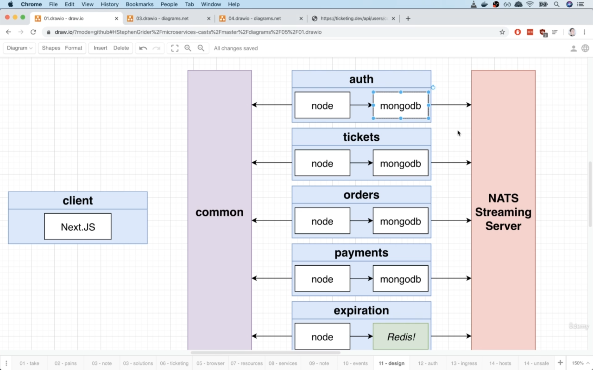
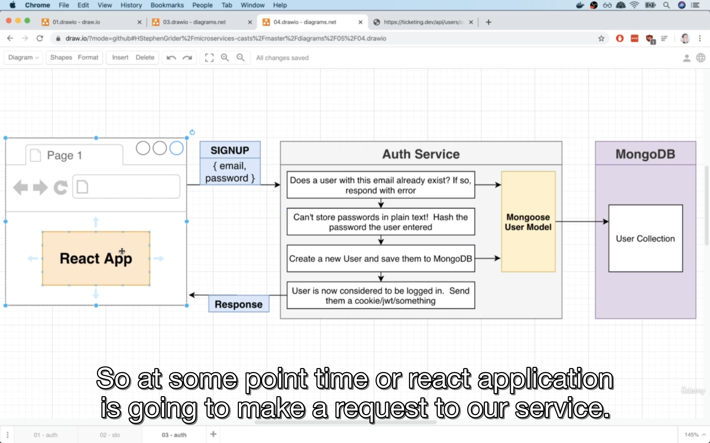
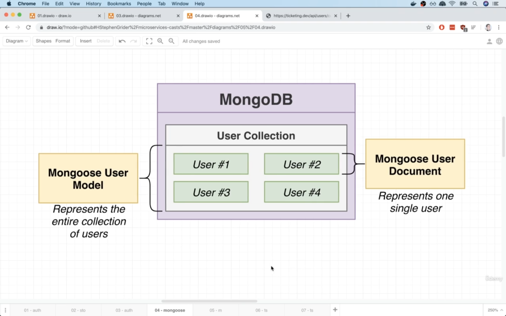
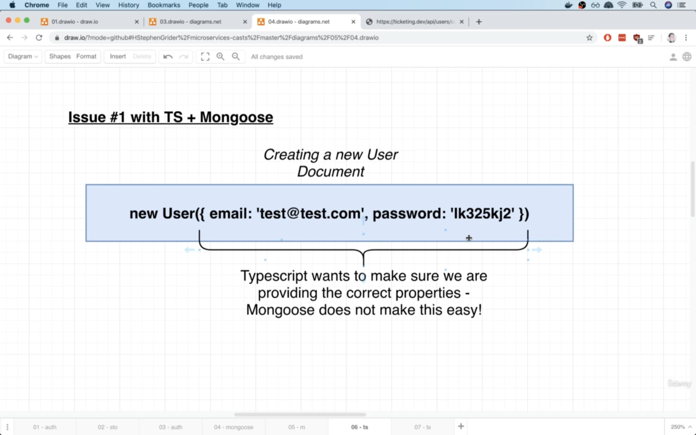
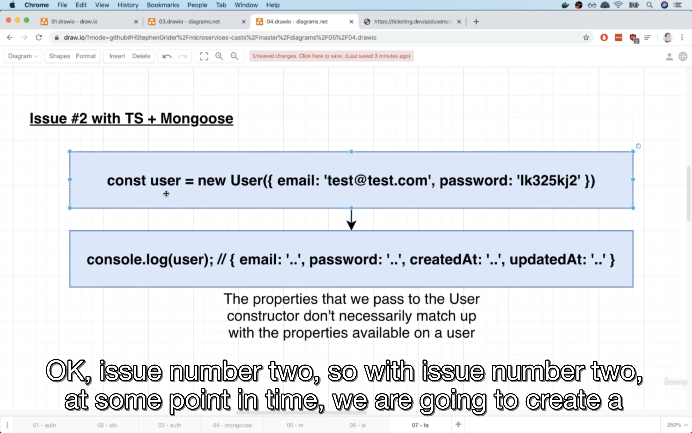
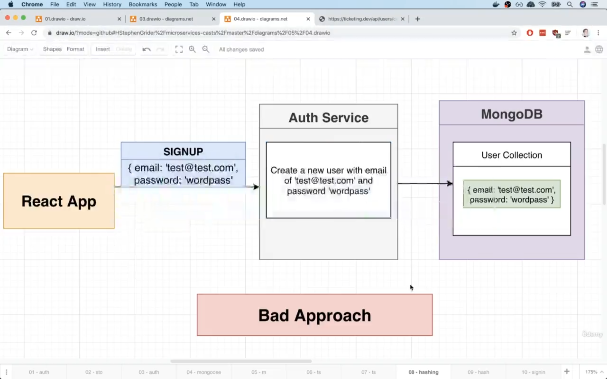
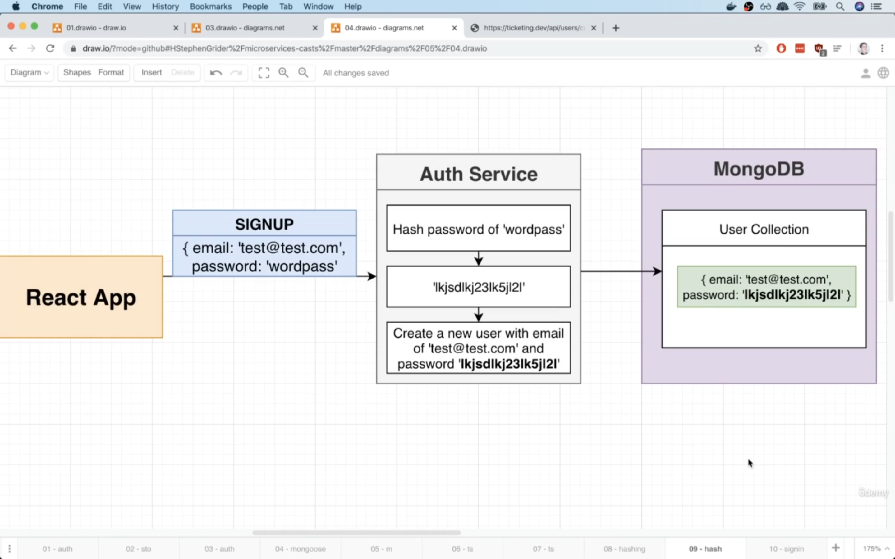
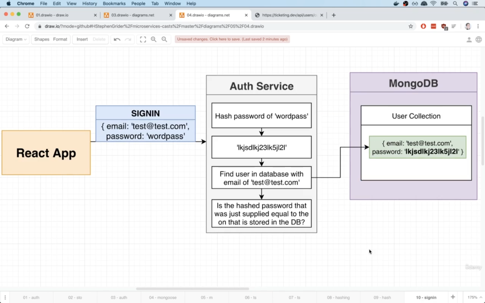

# 08 - Database Management and Modeling

## 147-001 Creating Databases in Kubernetes:
Whenever a user signs uo to our app, look at 147-001-1

Every service we're going to implement, is gonna have it's own private instance of mongodb and this goes back to the idea of one database per service.
Now install mongoose in the auth service.

Now that mongoose is installed, let's create a new instance of mongodb:


**Note:** Mongodb is just like any other thing that we're trying to run inside of our k8s cluster. We're going to be running mongodb inside of a pod and remember,
we usually do not create pods **DIRECTLY**. Instead, we make use of deployments. The deployment is gonna create a pod for us and in order to communicate with this
pod, we're gonna have to create a cluster ip service to go along with it as well.
In total, we're going to just be writing out one single deployment config file which has the deployment config and the cluster ip service config.

So create a file named auth-mongo-depl.yaml . This is the general naming strategy that we're going to use for our different databases that we create.
So they would be: <name of the service that owns this DB>-<type of DB like mongo>-<we're creating a deployment, so 'depl'>.yaml .

The `template` section in a `Deployment` config, is for pods and it contains:
```yaml
    labels:
      app: auth-mongo
```
is going to be a label that gets applied to the pod and this section:
```yaml
  selector:
      matchLabels:
       app: auth-mongo
```
is how the deployment is gonna find the pods that it actually creates.

When we have: `image: mongo` in Deployment config, we know that on docker hub there are a lot of different images hosted on docker hub for public use and 
there is an image called `mongo` there. So it refers to the mongo image on docker hub.

**Note:** After creating the deployment, we're also gonna create a cluster ip service inside of that same file so that we can actually connect to the pods that are
going to be created. So add in 3 dashes to indicate that we want to put in some configuration for another object.

When we put:
```yaml
selector:
    app: auth-mongo
```
inside of a cluster ip service, that is telling the service which pods it is going to govern access to. So in this case, we're saying find a set of pods or any pod
with the label of: `app: auth-mongo` and that matches with the pods we wrote in the deployment object of mongodb.

The `name` we put for an entry in `ports` section is only for logging purposes.

Why are we using 27017 as port numbers for db?
By default, mongodb listens for incoming traffic on 27017. That's the default port for mongo.
You would normally do a bit of research to figure out what port a given DB or a given application is going to be listening on. To do so, you would look up some
info about the image that you wanna use for that DB or app.

Now to create that DB deployment and the service, we'll do `k apply -f ...` or a better way of handling this would be to just make use of skaffold.
Remember skaffold is gonna try to deploy all the different files we list out inside the `manifests` section.

Sometimes skaffold does not actually see when we create new files with some objects inside them. You can hit ctrl+c then restart it by running skaffold dev again.

Once everything gets applied, we should be able to run: `k get pods` (Remember that you're connected to the right cluster in your context in docker desktop) and then
run k get pods.

So now we're running a copy of mongodb for our auth service.

Now we need to make sure our microservice service has some code inside of it to connect to the mongo instance which is running inside a pod.

## 148-002 Connecting to MongoDB:
Look at 148-002-1.

Right now, we have created a deployment that creates a pod that is gonna run our mongodb instance. We haven't really spoken about the lifecyle of pods in k8s yet,
but suffice it to say: if we ever delete or restart the pod that's running mongodb, we're gonna lose all the data that is loaded into our DB.
Later, we'll fix it and discuss why we're losing this data and figure out some way to give mongodb some persistent storage.

There are many ways that we can connect to mongo instance using mongoose. We're gonna use async await syntax.

If we're running or connecting to a mongo instance that is on our local machine, the connection string would be sth like: mongodb://localhost
But in our case, we're not really connecting to a mongodb instance that is available on localhost, instead, it is available inside of that other pod and 
remember to connect to that other pod, we have to go through that cluster ip service we had created. 

**Note:** Anytime we're trying to connect to a cluster ip service, we're going to write in the name of that cluster ip service where we would normally put a domain and
then put the port of cluster ip service. After port, put the name of the actual DB that we want to connect to. If we MAKE UP A NAME OURSELVES there, mongodb or mongoose will
create the database for us automatically with the name that we chose. Let's name that DB, auth, so mongodb will now create a DB named auth.

As of mongoose v6, do not add options object to that connect() method.

The reason that we defined a separate function named start() is that depending upon the version of node that you're running, you have to wrap all of your
async await code inside of a function which in this case that function is named start.
The latest version of node(in our case the `docker image` of node inside your cluster) can make use of await keyword at the top level(outisde of a function).

## 149-003 Understanding the Signup Flow:
Look at 149-003-1.


We want to make sure all the different users of our app have unique email, so check if a user ever signed up with this email address before.

In order to access the mongodb collection, we have to create a mongoose model which is gonna govern access to that collection.

Turns out that TS and mongoose do not really cooperate well. There is a library that gets mongoose and TS work a little bit more nicely.
But we don't use it in this course.

## 150-004 Getting TypeScript and Mongoose to Cooperate:
Here's the issue that we're gonna run into:


Mongoose model is a class that is gonna represent the entire collection of users(represents all of our data).

A user document is also a class and is meant to represent one singular user.

The issues are:

Ts wants to understand the different args that calling new User() is gonna accept. However, mongoose does not make this easy. Behind the scenes or more
specifically with the mongoose type definition file that we just installed(not required anymore I guess), whenever we try to create an instance of a user,
it is not gonna kinda tell TS about the different properties that we're trying to pass in. So we could make a typo when passing args to new User() (when we're
creating a document) and TS is not gonna complain or help us! Because TS is not gonna be given enough info by mongoose by default.

Issue #2:
At some point in time after we created a new doc, we want to access some of the data within that created new doc, like logging the doc, the issue is
we might end up seeing that that user doc has MORE properties than what we provided to the constructor when creating that doc. So behind the scenes,
mongoose might decide to add in a couple of additional properties to that doc as well, like createdAt or updatedAt or ... .

So the properties we pass into the constructor, don't necessarily match up with all the properties that are created on the user doc. 

This is also an issue with TS, because TS wants to know about all the properties that exist on the document. So we need to tell TS that in addition to properties
we passed to constructor(when we say: new Class(), we're passing args to the constructor of the class), there are going to be some other properties that get created behind the scenes
and assigned to the user as well. So we need to teach TS that there are kinda two different sets of properties. There's one set of properties that will
passed to the constructor and there's gonna be a second set of properties that we should be able to access on the user document that gets created.



## 151-005 Creating the User Model:
Create a directory called models and there create user.ts .

A schema is how we're going to tell mongoose specifically, about all the different properties that an entity is gonna have.

The `type: String` in mongoose schema is not tied to TS. This type is 100% specific to mongoose. It does not tell TS **anything whatsoever**.

Now if we play around with the User modal that was created by: `const User = mongoose.model('User', userSchema);`
those two issues will cause some problems.
For example if you say:
```typescript
new User({
    email: '...',
    password: '...'
});
```
still we don't see any error. However, there is no info about the args that are going to be provided to this User constructor being fed into TS right now!
So if we say:
```typescript
new User({
    email: '...',
    pas: '...'
});
```
there's no problem around TS. So TS has no idea about what is going on with the args we're passing to this constructor. So we need to teach TS about different 
properties we're gonna pass into that constructor.


## 152-006 Type Checking User Properties:
Currently, TS is not checking the type of args we're passing to the mongoose models. This is issue #1.

To solve this, create an interface.
Now use that interface to make sure that anytime we try to create a new document out of that model, we're passing in the correct set of arguments or attributes.
To do this, create a new function called buildUser. Anytime we want to create a new user, we're gonna call this function instead of calling new User() . 
So keep this in mind.

So we're not gonna follow the normal way of creating a new doc which is calling new <model class>(). Because we cannot really do effective type checking with TS if we follow
that normal pattern.

So we're putting an extra step to get TS involved in this process of creating a user.

This is how we solve issue #1.

So now anytime we want to create a new user doc or work with users in anyway, we now have to import two different things from that user.ts file. That is not
convenient.

We want to make creating a new user doc, somewhat similar to the normal way of new User() , so we don't have to memorize to call buildUser() anytime we want to create a
new user.

## 153-007 Adding Static Properties to a Model:
Let's write a slightly better way of writing out buildUser function so that's not a separate standalone function. Instead, we're going to get this thing builtin or
included with our User model.

The end goal is be able to say: User.build({...}) . The nice thing about this appraoch is we no longer have to export a separate thing from that user.ts and 
creating a new user is kind of a natural thing. Because we say: User.build() , so build a new user.

To add in a new method to our user model, right above where we create our model from the schema, we say:
`
<schema>.statics.<name of the function which we'll call> = (attrs: <some type>) => {
    return new User(attrs);
};
`

This is how we get a custom function built into a model. We add it to that statics property on our schema.

But this doesn't work! Because now if you say:
```typescript
User.build({
    
});
```
TS will throw: `Property 'build' does not exist on type 'Model<Document, {}>'`.

So this is yet another point at which getting TS and mongoose to work together is just a bit awkward. TS doesn't understand what it means to assign a property
to the `statics` object of a schema. We have to give more info to TS.

To fix this, create an interface that describes the properties that a User model has. So we're gonna write an interface that's going to essentially tell TS that there's
going to be a build function available on that User model and we're also gonna tell it what args are required to call it as well.
Create the `UserModel` interface.

Now because our interface is extending another one, the properties that are defined in the interface we're extending, are gonna available BY DEFAULT(this is the effect of 
extend keyword) on our new interface, but we can also define same properties but with different types for our new interface.
So when we have:
```typescript
interface UserModel extends mongoose.Model {

}
```
So now UserModel has all of the properties and their types that are available on mongoose.Model interface.

Now to tell TS about the existence of UserModel interface, add the USerModel as the SECOND type parameter of `mongoose.model()` so now we have: `mongoose.model<UserModel>()`.

We have solved issue #1. We have not really solved anything related to issue #2 where we needed to somehow tell TS and mongoose that the set of properties
that we pass into creating a new user, are different than the properties that END UP on a user doc.

The UserModel interface represents what the entire collection of users look like(so it has mongoose.Model properties + the ones we define(in this case, `build` method))

## 154-008 Defining Extra Document Properties:
Create another interface named `UserDoc` which represents what properties a single user DOCUMENT has.

If we ended up adding in additional properties to the user document, or if mongoose automatically added those properties in(like createdAt and 
updatedAt), that `UserDoc` interface is where we list them. **But** in our case, we're not telling mongoose to add in those properties for us right now.
So don't add createdAt and updatedAt. We have not createdAt or updatedAt as properties of a user document, so don't add them. Even if we know mongoose
is gonna add in those properties automatically for us. Now to tell TS that: Hey, it's OK if we want to access the proerties it's gonna automatically add to a document for us,
all we have to do is to now add them to UserDoc(now that you learned, you can add them).
But for now, because we really don't USE those automatically added properties, let's remove createdAt and updatedAt from UserDoc interface, again, because 
we don't USE them in OUR CODE(but in runtime, they are in the user document, we just didn't define them at compile time in the interface).

Now add this new interface to UserModel's build method and first type param of mongoose.model() .

Now we can access user's email and password. So we can access document's properties. If we didn't use UserDoc interface, we would not be able to access these properties safely.

## 155-009 What's That Angle Bracket For:
When we have sth like:
```typescript
const User = mongoose.model<UserDoc, UserModel>('User', userSchema);
```
you can think of those types in angle brackets as being some arguments to the model() method, but instead of being an actual value, it's a type.
So you can think of these as being types being provided to a function or method as arguments.

Generics allow us to customize the types being used inside of a function, method, a class or an interface.

## 156-010 User Creation:
Currently, when we send a response back when user was created(signup route), the password was included in the response which we do not want to do.

## 157-011 Proper Error Handling:
For handling an already existing user error in signup, let's create a new custom error and rather than send back some message or response in the route handler manually, 
we're gonna throw that custom error. This new custom error is gonna be a very general use error. 

We're gonna use this custom error anytime sth goes wrong inside of request handler **due to some input that a user gave us**.
We're gonna throw it anytime just about anything goes wrong if we don't have some reason to make other error.

This is a different error than RequestValidationError, the goal of RequestValidationError is to handle output from express-validator. That is exactly and ONLY
what this error is supposed to handle.

So create a file named bad-request-error.ts .

**Note:** To receive or capture the arguments that user of a class pass to that class when instantiating it, we need to define the constructor in that class and receive those 
arguments.

super() call is executed before TS jumps in and saves a reference to that property that was declared with that trick(using an identifier with property name to declare a property
in class) on the instance of class. So we cannot use `this` inside () of super() call. But after calling super(), we can access `this`.

## 158-012 Note on Password Hashing:
Hi!

The four videos after this are all about storing a password securely with MongoDB. Given that this is a course about microservices, I do not provide a tremendous
amount of information about the password hashing process. Instead, I give a quick review of the process, and I assume you are already familiar with it.

If you are not familiar with password hashing, or if you want to save some time, I would skip over the next four videos. You will need to download the code including
password hashing and add it to your project if you skip these videos.

You can download this completed code by getting the zip file attached to the video titled Mongoose Pre-Save Hooks. Unzip the code, then drag and drop the 
auth directory into your project directory. This will overwrite your code with the password hashing setup.

## 159-013 Reminder on Password Hashing:
We need to hash user's password before we send it off to DB to be saved.

The bad approach that we're currently doing:


Currently, the user's password is in the user's collection in plain text! This is very bad, because if anyone ever got access to our mongodb DB, they would
see all the emails and passwords of our users. Also it's possible that if some malicious person gets access to all the emails and passwords that are in DB in 
plain text, the users of OUR app might use the SAME email and password combination to log onto many **OTHER** services and so a malicoius user could test those 
exposed data of DB and try to to log onto for example the banking website and they might possibly succesfully login. So under no circumastance, do we ever
store the passwords in plain text.

Password hashing is a two step process that spans over signup and signin flows.

This is what happens during signup(more secure implementation): 

The good approach:


When we hash a string, it's gonna produce a unique series of characters that are unique just for that word(that very particular string). 
Store this hashed password and not the original plain password.

With the hashed password, there's no easy way to figure out what the original password was? So if some malicious user somehow got access to
that email password combination, in theory, hopefully, there would not be much damage done.

There are some scenarios where even a hashed password can have some negative consequences and in general, we don't want anyone getting access to our data at all, 
but if some malicious user does get access to this hashed password, it's not as big a problem.

That was the signup process. How do we actually make use of hash password at some point in time in future?

The signin process:


As soon as we get user's email and password from the signin req, we're going to hash the password in the exact same way that we did when
user signed up initially and we will get that same identical string of hashed password. We're then try to find a user saved inside of our DB with the
same email as the one that was just submitted. Now at thos point, we've got the stored hashed password of the user and we've got the hash version of
the password that the user just sent to us. We're gonna check if the hashed passwords are equal to each other, if they are equal, that means that the user
must have supplied the correct password and then we consider him signed into our app.

## 160-014 Adding Password Hashing:
There are many different ways of implementing password hashing.

Some of the tutorials recommend that you place all this password hashing logic directly into your User model file. So in user.ts , we would
write a lot of code to hash the password and then store it along with the user.
We're gonna do sth similar to that, but we're gonna break our logic into two separate files. We're gonna make a separate file that has a class that is just
responsible for taking a string and hashing it. Inside that class, we're also gonna have a method that's going to compare two different hash strings.

So the majority of the actual hashing logic that actual implementation is gonna be in a separate file, in a separate class and we're gonna use that inside of User model
file. The reason we're doing this, is to keep our User model file cleaner. That's why we're gonna  place a lot of this hashing stuff in another location.

Create a folder called services and there create password.ts .

What is a static method?

Static methods are methods that we can access without creating an instance of the class. We can call them by saying: <class>.<static method> . So we don't use
any `new` keyword (create a new instance of that class or use an instance) and then access the non-static method. 

`scrypt` hashing function is callback based, so we use `promisify` to make it a promise based implementation to use with async await.

When we scrypt, we get back a buffer which is kinda like an array with raw data inside of it.

When we say:
```typescript
const buf = await scryptAsync(password, salt, 64);
```
if you look at buf, you see it's of type unkown so TS is getting a bit confused because it doesn't know what happened during the promisify process(promisifying the
scrypt). Use type annotation on that await scriptAsync() .

In `toHash` method, return the hashed result along with the `salt`.

`toHash` method takes an arbitrary string, generate a salt, it's gonna hash the password along with salt and we return both the hashed password and salt concatenated by a 
dot.

## 161-015 Comparing Hashed Password:
In `toHash`, we're not only generating a hash password, but we're also concatenating on there at the end, separated by a dot, the salt as well. So the storedPassword
argument of compare method is not just the hashed password, it is the `hashed password + . + salt` . 
So by splitting it, we can get the real and actual hashed password that is stored in our DB and also salt that is generated during the initial hashing process(we store 
the salt **along**(delimited with a dot) with hashed password in our db, so we can retrieve with from DB).

In compare() we get the original password that is stord in db by splitting the stored password and also a buffer containing the newly hashed password(the one 
user just sent to us). Now we take the buffer, turn it into a string and then compare it against the hashed password(which was in DB).

In `compare` method, we see if the supplied string is equal to the one stored in DB. So along the way, we need to hash the supplied password to check it with the stored one.
We hash the password using scryptAsync along with the salt that was stored in DB(so that the salts are equal both when we originally hash the user's password
and also now that we want to compare the new sent password to the original one).

## 162-016 Mongoose Pre-Save Hooks:
Let's implement some code to automatically intercept the save attempt on users collection. It's gonna take the plain text password that we've set on the user doc, hash it and
then overwrite the password on document.

Mongoose like express is in the old way of doing things. Mngoose doens't have great support out of the box for async await syntax, instead, to handle any
kind of asyncrounous code that we want to run inside that callback of pre save hook(or other hooks), we get that `done` argument. So WE are responsible for
calling done, once we have done all the work we need to inside there, rather than just saying `await ...` and then letting mongoose figure out what's going on,
we HAVE TO do the awaits and then at the end, we have to call that done argument.

Note: We defined that pre save middleware using function keyword, as opposed to an arrow function. It's because whenever we use a mongoose middleware function,
we get access to the document that is being saved with `this` keyword inside of that function. If we used an arrow function for the callback of mongoose middlewares,
then the value of `this` inside the function would be overriden(this is not a correct sentence, the correct is arrow functions don't have their own `this`) and would be actually
instead equal to the context of that entire file as opposed to our user document, that's not what we want, so use a function with function keyword instead of 
arrow function.

In the pre save middleware, we're gonna check if we've modified the user's password. The reason for this, is that we might be retrieving the user out of the DB and 
then trying to save them BACK into the DB at some future point in time. For example let's say we have a email change functionality. That would involve 
us fetching a user out of the DB, then changing the email and then trying to save it to the DB again. In that scenario, we would STILL be running that pre save
middleware. If we only change the email, we would not want to try to re-hash the password or anything like that, because that means that we would be hashing a ALREADY HASHED password.
We don't want that. So we're only gonna attempt to hash the password if it has been `modified`.

When we first create a user and assign the sent password to him, mongoose will consider password to be `modified`. So even if we're JUST CREATING that document FOR THE VERY
FIRST TIME, `this.isModified('password')` will return true.

In the past, when a user signed up, we returned his password in plain text, that was very bad, now we send back password in the hashed format.

Now we're no longer storing passwords in plain text inside of our DB.

After we have SAVED the user into the DB(means he just signued up), we now consider this person to be logged in. So we need to figure out how we're gonna
actually consider a person to be logged in? We need to decide whether we want to use a cookie, a JWT, or ... .