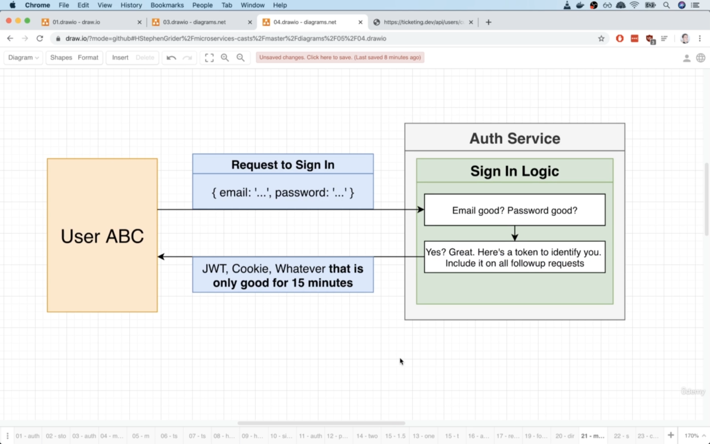
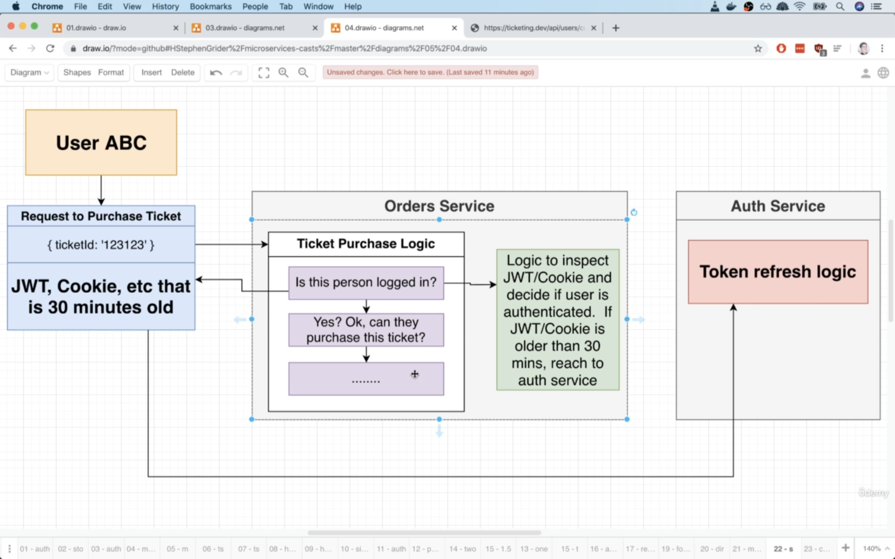
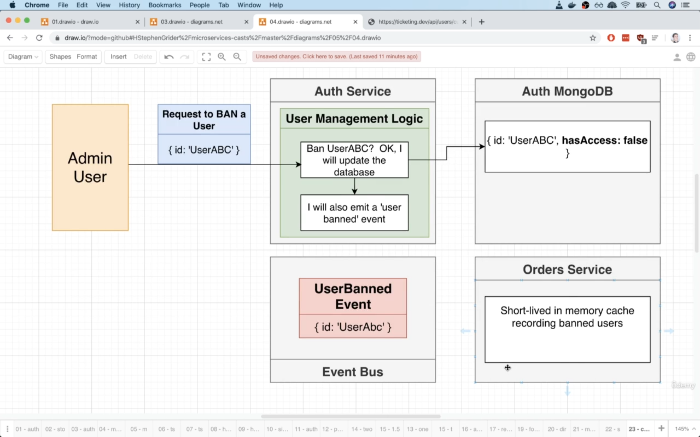
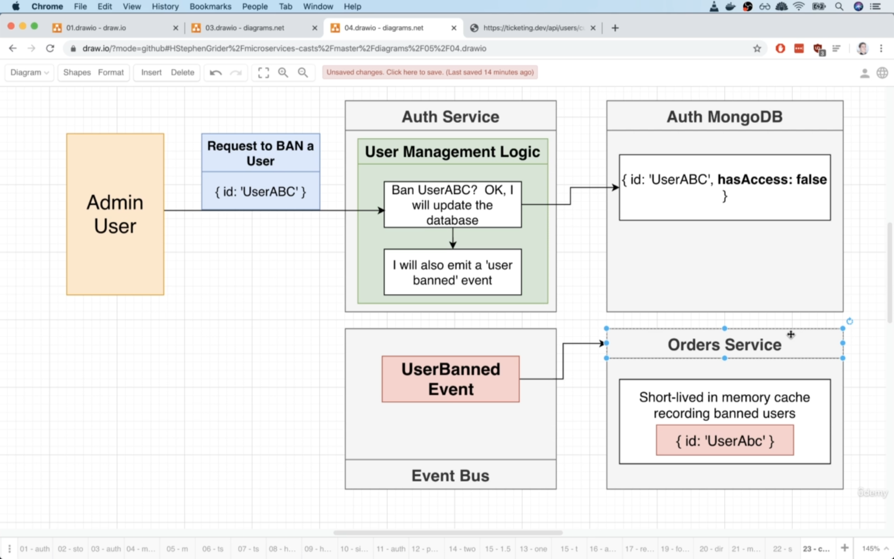
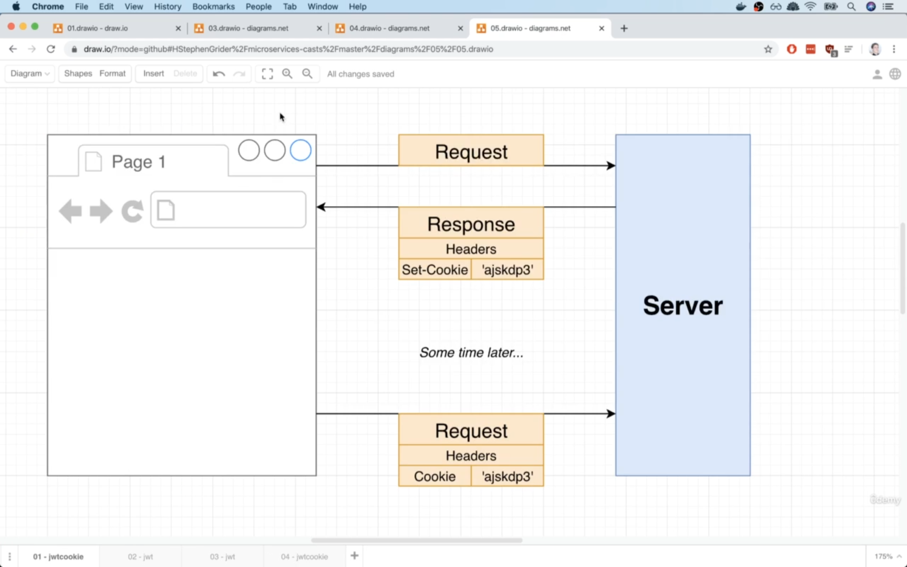
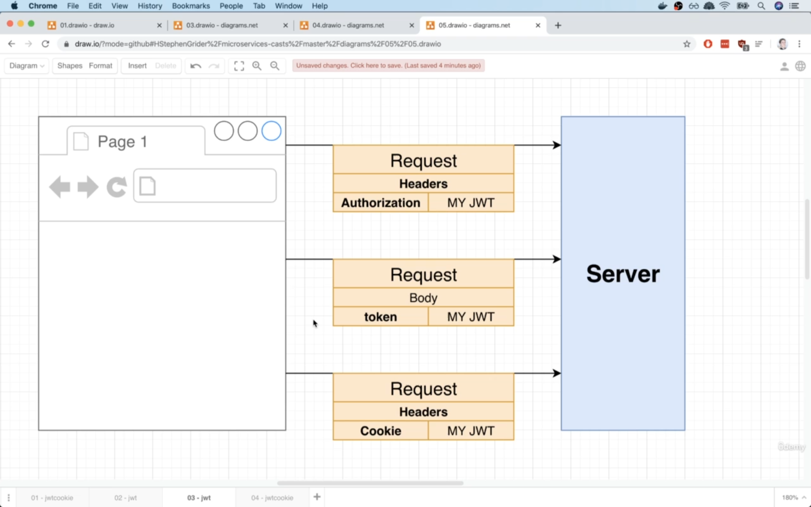
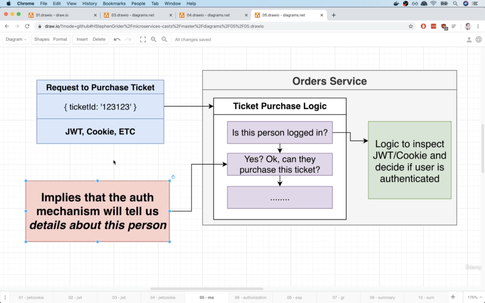
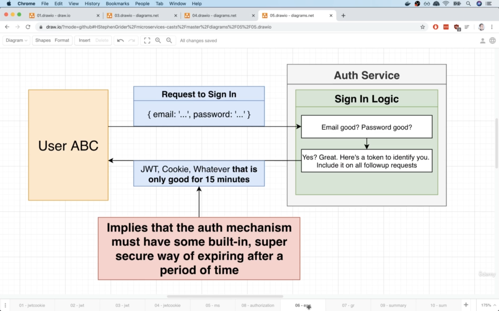
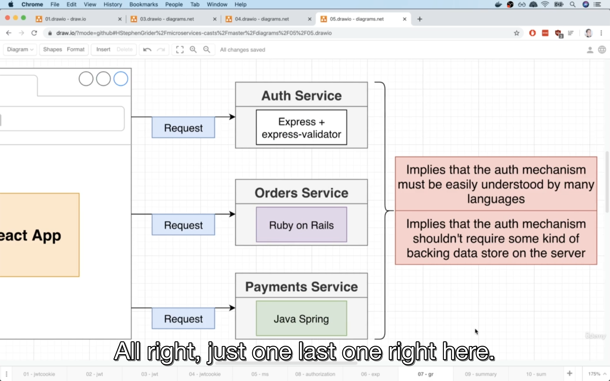
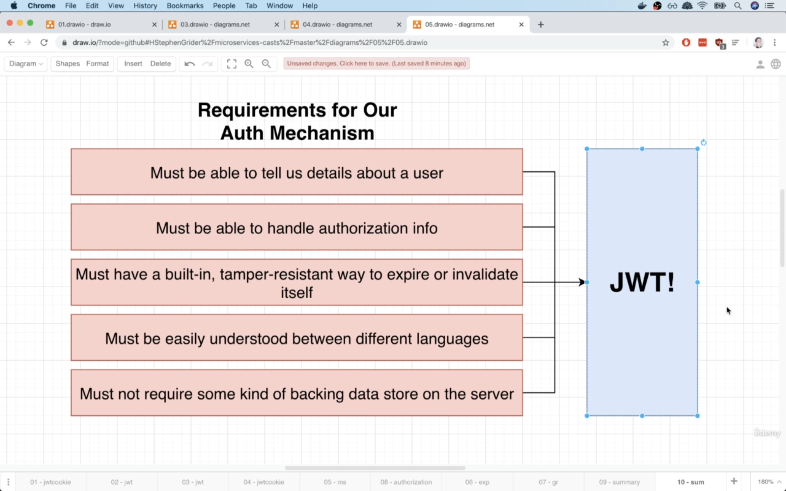

# 09 - Authentication Strategies and Options

## 163-001 Fundamental Authentication Strategies:
Handling authentication, handling the process of making sure that someone is sending this req to us, is logged into our app is challenging in microservices.

Handling user authentication, in other words, giving a user a cookie, a JSON web token or sth similar and allowing them to access other services inside
of our app is a challenging problem that is not really solved. In other words, there is not really a perfect solution to handling this stuff.

So instead, with microservices and in the context of this course, we're gonna try to outline a couple of approaches in handling authentication.

Approaches in how we can say: "Hey user, here's a cookie or here's a token. Give this to us in the future" and how we can decide whether or not a user truly is 
authenticated.


User authentication comes down to how we answer this question: How do we decide whether or not someone is logged-in in a microservices app?

There are 2 approaches for this:
The reason there is the word `fundamental` in pictures, is that there are variations of each of these approaches. All of the different strategies
out there really come down to 2 very funamental principles.

1) **option #1**: The idea is that we allow individual services to rely on some centralized authentication service to decide whether or not a user is logged in.
   The `sync request` in the img is related to world of microservices not the world of JS. In the world of microservices, sync req refers to a direct req
   from one service to another, one that does not make use of events or event busses or anything like that.
   So the downsides of fundamental option #1, really shares all the same downsides as synchronous communication in general. If we used this solution, think about
   what would happen if the auth service just mysteriously went down one day? If that thing crashed or just disappeared, all of a sudden, no one, no service
   inside of our entire app can decide if a person is logged in and that means that any req that requires us to decide if a person is authenticated, is 
   automatically going to fail!
2) **option #1.1(variation of #1)**: This option is very close to option #1 because we're still relying upon the auth service 100% of the time. With this, any req
   coming into our app, would need to go through some central gateway of sorts, that would authenticate the incoming req. For example, 
   whenever user makes a req to purchase a ticket, rather than going directly to the orders service, we would instead have it flow into some
   auth gateway or some auth service of sorts that would inspect that incoming req and decide if the user is authenticated. If they are, we would then
   send the req along to the intended destination, otherwise we would just reject it right away. This still shares a lot of pros and cons of option #1, because 
   we still have a 100% reliance on the authentication service in both cases. If this thing ever goes down, all of a sudden we cannot make a single req that
   requires any kind of authentication. 
3) **option #2**: We're gonna teach each individual service how to decide whether or not a user is authenticated. In this scenario, we have no dependency on 
   outside services, no dep on a gateway or some other service or anything like that. Everything is wrapped up inside of one single service and if a user
   ever makes a req to for example the orders service, we will immediately and instantly know whether or not this user is logged in.
   **Upside** is we do not have any outside dep.
   **Downside** is that we're gonna end up duplicating auth logic between all of our services. But the solution is we can move this auth logic into a shared library that's
   used among all of our services. But there are some much more larger critical downsides of this option. We'll see them in next vid.
   

approach #1:


approach #1.1:


approach #2:


## 164-002 Huge Issues with Authentication Strategies
In authentication solution #1, we had a reliance or dep on some central auth service(#1).

We took a look at a slight variation of that, where we had some central gateway that would block unauthenticated reqs(#1.1).

We also had another one(#2) where we're gonna teach each service how to authenticate an incoming req.


Let's say a user logged in to our app and got a JWT. Now after some time, we ban that user using the auth service which is decoupled from other
services of our microservice. But that user still has a valid jwt and he sends a req to some service in our microservice and that service doesn't 
care about auth service, it's decoupled from auth service. So even though the auth service is 100% certain that this user should not have access to
our entire app, at no point using option #2 do we ever go over to that service(auth) to figure out whether or not this person is authenticated.

That is the core issue with approach #2. Even though we get this fantastic separation of services, we don't have any deps, there are still going to be 
scenarios where we try to update data in one location tied to a user status, but all the other services are not going to hear about that update(like a user
just banned). They don't know. They don't have any logic to be told: Hey, this user is now banned or sth like that, because there's no direct connection between
the two.


So all this authentication stuff is a nasty thing. It is an unsolved problem. There's no single solution out there that is just the right way to do it.
We can try to figure out some clever ways to work around some of these restrictions.

We're gonna use a solution even though it still has some downsides.

## 165-003 So Which Option:
We looked at 2 options for handling the question: whether or not a user is authenticated inside of our app.

Option #1:
**pros**:
Anytime we made changes to our auth state or the access of a user, it would be immediately reflected throughout the **rest** of our services.
So if we said a user was banned, as soon as the next service came and asked about the status of a user or whether or not they were actually signed in, we could
absolutely say this person is banned, do not allow them to access.
But there is a downside too which is in image.

cons: in image


Option #2:
pros: In image
cons:
If some user ever got banned, there is going to be a window or a period of time where we were gonna continue to trust that that user was actually signed in.

In microservices, the async communication really leads to a huge amount of independence between our different services. But we can have a hybird of sorts.
We can have a set up where we've got a ton of async communication going on, but we can also have some little instances of sync communication as well.

For the problem with updating the authentication status of users(like banning them) which can also be a security issue as explained, we will solve it in the future.


## 166-004 Solving Issues with Option #2:
The strategy that we're gonna suggest in this vid, is not gonna be used. Because it's a tremendous of extra work but it's a viable strategy.

1) In this strategy, when we send back that jwt or cookie or ..., we're gonna somehow make sure that that thing is only viable for that next 15 minutes.
How? Well, there are mechanisms around JWT in particular, for making sure that it's really clear that this token is only viable for some set period of time.

Let's now imagine what would happen if user ABC attempted to make a req to purchase some ticket through our orders service.

Flow: They're gonna make a req to purchase a ticket and they're gonna supply a json web token, cookie or ... which let's say it's 30 minutes old.
So in this scenario, we're gonna say that they have some expired jwt. So when they make this req, we're then going to ask if this person is logged in? Because we're
following option #2, we're going to rely upon our orders service to take a look at that jwt and decide if the user is authenticated?
So we're gonna run some logic to look at that token and critically inside this logic, we're going to add sth to say if that jwt is older than 30 minutes, then this person
is **not** authenticated. If they have an expired token, there are **two** ways that we can deal with it easily.

We can either have our orders service(and that logic for auth inside there), attempt to reach out to the auth service and get a new **refresh** token.
So we could reach out directly with a synchronous req to the authentication service, get a refresh token and then when we respond to the overall req(purchase ticket req),
we could **include** the new refresh token and send it back to the user ABC.

That is one possible approach and would allow us to refresh the token all in one req while still acheiving the overall goal.

The nice thing about this approach is that it requires us(if this token is expired), **to reach out to the auth service** and so that would be a time
for the auth service to chime in and say: Hey, this person is banned! Don't allow them access or sth like that.



2) The other strategy we can take here, if we do not want to have the synchronous communication, we could say that if the jwt is older than 30 minutes, 
then we're just going to reject the overall req. So we could return early and send back an error and tell them: Hey, before you make a req to us,
you need to go and refresh your token and so rather than doing the sync req ourselves, we can tell our **client** that they have to go over to the auth service(like
logging in again which will send a req to auth service) and refresh that token on their own and once that's done(once they got the updated token), that would
now be like 10 seconds old, now they can make the follow up req or repeat the same req again to **purchase** a ticket with the brand new refresh token.

So the diagram in case the jwt was expired in this approach would be:


So this definintely solves kind of the issue. Why kind of?
Because we still have a window here, a window of 15 minutes where we could potentially ban a user and then they could **continue** making reqs in the window of those
15 minutes! and so this is where it really starts to get into your personal implementation or the requirements of whay you're building.

You might be building an app where that 15 minutes window is tolerable. You could even take it down to 5 minutes or 1 minute and there might be some window of 
time that you would be happy with and saying: Yeah, if the person gets banned, they can still make reqs in the span of time, I don't care.

But on more secure apps, there cannot be any period of time where a user gets banned and then can make follow up reqs and still be authenticated.
In this case, here's what we would do:


In this approach, we would imagine that an administrator user would make a req to ban user ABC. It would reach auth service and there we would have some
user management logic and we would reach out to our DB and mark user ABC as not having access anymore. So they're banned as far as the auth service is concerned.
**But** we want to reflect this change immediately with all of our services as well and we would probably want to do so using the same communication patterns
as we've seen, in other words, using events as opposed to synchronous reqs. So here's how we would handle this:

Right after we update the DB that that user is banned, we would then also emit a `user_banned` event or sth similar. It'd be some kind of event that says:
Hey, all services out there, anyone who's listening, do not allow this user to access the app. We would send that to event bus and that event would be sent off
to all of our different services. Then inside each of our services, we could take that info out of that event and we could persist it in some very short lived]
cache or some kind of short-lived data store. Something to say: Hey, here's all the users who should be banned and who should revoke access to.

The reason for using short-lived in memory cache, is that remember we don't really want to be storing a list for all eternity of the users who are banned.
Users might get banned or unbanned all the time.

The reason we're saying short-lived is that we can just persist this data for 15 minutes which is the same duration of time as the lifetime of these 
JWTs, because after 15 minutes, we don't need the store anymore. After 15 minutes, our service is gonna immediately know that incoming JWTs are expired, so
immediately they will reject the req. But within those 15 minutes, we can **temporarily** store this info that this user should be banned.

So we only need to persist this list of banned users in each individual service for an amount of time equal to the lifetime of our auth mechanism.

Upside to this approach is that we can immediately ban a user from all of our different services. 

The downside is that we have to have some implementation in each service, for listening to that UserBanned event, storing a list of banned users for a period of time and
then comparing whenever we run some authentication logic.



So this is how we can still implement option #2 and not have any window of security issue whatsoever inside there. But we're not gonna implement this stuff. 
So we can go with option #2 and have a very secure approach.

We will start to implement option #2 in next vid.
 
## 167-005 Reminder on Cookies vs JWT's:
Each service should understand what authentication is and how to determine whether or not someone is logged in?

Now we're going to establish exactly how we're going to prove that a user is authenticated.
In other words, are we using JWT or cookies or what?

### difference between JWT and cookies
Cookies:

Imagine a browser making a req to a server. When the server sends a response back to the browser, it can optionally include a header of `Set-Cookie`
and then for that `Set-Cookie` header, it can provide some kind of value. This value can be a string that contains any info that we want.
That little piece of info is then going to be automatically stored inside the browser. Then, whenever this browser makes a follow up req to the same
domain with the same port, the browser is going to make sure that it takes that little piece of info and appends it onto the req as a cookie header(that
little piece of info in diagram is 'ajskdp3'). It will be automatically sent to the server.

The idea of saving a cookie is that some arbitrary piece of info, doesn't really matter what this info is, it can be anything.
That piece of info will be automatically stored by the browser and automatically sent to the server at anytime we make a followup req.



### JWT:
With a JWT, we're going to take some arbitrary piece of info that we refer to as the `payload`. It can be some object that has maybe a userId or ... any info.
We're then going to take that payload and throw it into a json web token creation algorithm. It's then going to spit out our JWT that looks like an encoded
string like in diagram.
Stored in that encoded string(JWT), is that original payload. We can easily take that encoded string, throw it into some kind of decoding algo and extract
the original object(payload). So at any point in time, we can always access the info(payload) that is stored inside the token.


Once we have this token, we eventually do need to communicate it between the browser and server. There are a couple of different methods that we can use to do
this communication:
Whenever the browser makes a req to the server, it's going to want to include that JWT in one way or another so that the browser can prove that it is
authenticated or it's logged in with this particular server.

To communicate that token over to the server, some very common approaches are:
- to include an authorization header that has the JWT inside of it(like: `Bearer <JWT>`)
- we can just throw the entire token inside the body of the req(assuming that it's a POST req or a PUT req or a DELETE and ...)
- or alternatively, we can also kinda mix and match here and take that JWT token and store it inside of a cookie as well. So the JWT will be managed
  **automatically** by the browser included on all followup reqs.



Differences between cookies and JWTs:


- Cookies are a transport mechanism. They're a way of communicating info between the server and the browser and they do not necessarily do anything closely
  coupled to authorization. Yeah, we use them for authorization, but that's not necessarily the primary purpose(goal) of them. It's not the only thing
  they can do.
- We can use cookies to move any kind of data between the browser and the server, so it doesn't have to be authentication related stuff, it can be tracking information,
  it can be some kind of visit counter, just about any kind of data we can easily store inside that cookie.
- cookies are automatically managed by the browser. We as developers, specifically on the browser side of things, don't really have to worry about managing them
  in any way. All we have to do on the server is set a cookie and then we can pretty much guaraneteed that will always come back in all follow up reqs.

JWT:
- these are all about authentication and authorization. That is what they are intended to serve.
- inside of a JWT< we can store any structure of data that we want. It's traditionally going to be an object with some key value pairs.
- JWTs have to be managed manually by developers on the frontend, unless we're storing that JWT inside of a cookie.

So the cookie is just a transport mechanism. It's sth that's going to hold info. It can be any kind of info, it's not necessarily tied to authentication.
JWTs on the other hand, traditionally always used for authentication and authorization.

So we need to decide based on pros and cons, which one is more appropriate or combination of the two is most appropriate for handling auth inside of a microservices 
architecture.

## 168-006 Microservices Auth Requirements
Cookies and JWTs are two very different things. The implication here, usually when we say that we're using cookie based authentication, the implication is that
we have a cookie that is going to store some kind of encoded token inside of it and that's gonna be encrypted in some way that the user cannot access the
information inside there.

Now let's see our app requirements and see which of these two approaches is gonna satisfy those requirements.



Inside of our ticket purchase logic, we probably needed to figure out whether or not that user is logged in and OK, we can use a JWT or some cookie based
approach for this(look at green box) and then after that, we probably needed to decide whether or not this user can purchase a ticket. So maybe whether or not
they have billing set up in their account, whether or not they have a credit card or ... . This implication that we need to somehow figure out whether or not
this user or details about this user, really implies that our authentication mechanism needs to tell us information about the person who was just authenticated.
In other words, we can't just have some mechanism that says: Yes, this user is authenticated or no, they're not. 
Instead, this authentication mechanism has to tell us: Yes, this person is authenticated **and here is some information about them: here's their
userId, there's their email, here's whether or not they have a credit card tied to their account.**
So we need to have the ability to store info inside of our auth mechanism. This is requirement #1.

Requirement #2:
Imagine a new scenario:

Imagine that our app has the ability to create free coupons. So these are coupon codes that allow people to get free tickets.
Of course we probably do not want any arbitrary user to be able to access this route handler and start creating free tickets.
So maybe we want to limit this route to admin users. So only admins can make a req that will create a free coupon code.

In that route handler, we need to check whether or not this person is authorized to create free coupons. So we need to decide wherer or not this is an
admin user.

This step is really implying that our auth mechanism has to include some amount of authorization information. We need to know more info about this user. Are
they user? Are they admin? What's their role?


This diagram shows one way to solve the updating status of a use(like being banned) is to have an auth mechanism that would expire after some set of time.
So this is implying that whatever mechanism we're going to use, it has to have a built-in way and a super secure way. In other words we would not want a 
user to be able to tamper with this in some way of expiring our auth mechanism after a set period of time, a very precise period of time.


One of the big benefits of using a micro services approach, is that each of our different services can be built using a different backend language.
This is implying that whatever auth mechanism we decide to use, it has to be easily understood by many different languages.

Also, given the fact that each of those different services that might be written in different languages, are going to need to somehow authenticate
a user, we probably do not want to force any storage requirements on these services as well. In other words, if we're deciding on some auth mechanism that is going
to require us to have some backend DB just to store info to support that auth mechanism, that would probably be bad. We don't want to force for example
our orders service to have some kind of specialized DB to store information just to support our auth mechanism. That is not good.

Summary of the requirements for our auth mechanism:


So:
- first we have to store information about a user like userId and ... , within the auth mechanism itself(JWT or cookie) which is closely couped with the last item.
  So if we're storing info about that user, it has to be inside the auth mechanism and it must not require us to have some kind of backing data store.
- with second item, we can say whether or not this person is an admin, a normal user or ... .
- ...



All these requirements are steering us towards a JWT approach. Why?
- because JWTs can store any arbitrary information we want about a user.
- There are even built-in properties of JWTs that lend it to a handling authorization very well.
- JWTs can encode expiration info. you might be saying: Hey, cookies can do that as well, we can have cookies expire after a set period of time.
  Well, not quite. We can set some expiration on a cookie but that is us kind of politely asking a browser to expire the cookie. Cookie expiration is handled
  by the browser. So the browser is going to receive a cookie. It's going to see that we ask the browser to expire that after, say, 20 days and after
  20 days, the browser will expire that cookie for us. **BUT!!!** a user could very easily copy that cookie info and just ignore the expiration date on there and continue
  using that cookie in the auth mechanism or auth info inside there at some point in time in future, even beyond that expiration date. 
  A JWT however, is going to encode the expiration time in itself and as soon as the JWT expires, then that's it. It will not be valid anymore.
- JWTs have fantastic support between different languages. If we use solely cookie based authentication where we kind of create some kind of custom token and
  store it inside of a cookie, it turns our that a lot of these different custom cookie implementations will vary significantly between different languages.
  It would be kind of hard to create a cookie that is signed securely(so has some actual kind of secure or encryption around it) using nodejs and then reuse that
  over in the ruby on rails world.
- JWTs do not strictly require us to have some kind of backing data store to identify this user.
  Now as opposed to cookies, you will see a lot of people who will use cookies, they're going to try to store, just say a session id inside the cookie that
  refers to some session that is stored on a backing server. That is not strictly required. We can store again any arbitrary info we want inside of a cookie, but
  you're gonna see that a lot of people say that in cookie based authentication, you're going to store some kind of session id and so of course that implies that
  you will have a backing data store on the server. Which again, we probably do not want to have.

So we're gonna use JWTs.

**Important:**
We're still not done here. Remember, when we decide to use a JWT, that's not the end of the story, because JWTs are just an auth **mechanism**. They're a 
piece of data that proves that someone is logged in and store some info about the user. We still have to somehow communicate this info between our
browser and our server. We can do it either manually to a degree using that top yellow box(headers), or sticking it(the JWT) into the body of the req(middle yellow box),
or we can have browser handle it for us using still this kind of cookie based idea(that bottom yellow box)!
 TODO: WHAT IS THIS?

In the bottom box, we're saying that we're going to use a JWT token to **store**  our auth **info**, **but** the cookie is going to be the **transport** mechanism.
That's how we actually move the cookie around between the browser and server(that cookie in itself has a jwt)

So we still have to decide how we're going to move this token around(using one of those 3 options)?

---

## 169-007 Issues with JWT's and Server Side Rendering:
We need to decide how we're going to communicate that JWT over to our backend services?


Some further requirements of our app:

Diagram about what goes on during the loading process of an application into the browser, when we're writing a **normal** react app:

User types out ticketing.dev and then browser is gonna make a GET req to ticketing.dev, then with a typical react app, we're gonna immediately send back an 
HTML file that is pretty much bare bones. There's not really gonna be anything inside there except for a little bit of html, some script **tags**,
some css tags, maybe some other stuff, but for the most part, there's not gonna be a lot of markup inside that file.

That file is then gonna be load up by the browser, the browser is gonna see all those script tags and it's gonna decide: Oh, I need to make a follow up req to the
backend client(grey box) and get all the associated JS files to actually boot up and execute this react app. So we're gonna make a follow up req for some
JS files, these are all technically all **separate** reqs(the third blue box from top), but whatever, if there are **multiple** files,
we're gonna send back all these different JS files and the browser is gonna execute the code inside them.

That is when our react app is gonna actually boot up inside the browser and at that point in time, we might need to make some reqs to get some data. So the react
at that point, might make a req to the orders service, asking for some data and the orders service respond with that orders data, the react app will then
take that info, build some html and displayed it on the screen to show to users(flow of **typical** react app).

Q: We're looking at more or less 3 reqs here. The initial req, a follow up req(s) to get some JS files or css files and then a third req to get some actual data that
app needs. Considering these 3 reqs, at what point in time, do we need to somehow communicate authentication info from the browser over to the backend?

We don't really need to know if the user is logged in during the initial req(2 blue boxes on top). There might be some scenarios where we do not even want to
send a user a react application if they are not logged in, but for the most part, we usually say that we don't really care about sending out the source code for
a react app. Don't we want to secure the source code? TBH, no that's not sth that's very commonly done in the production world.

Now, do we need to know about authentication with JS files(and css)?
No, for the same reasons, we don't care if users logged in. Yeah, we don't care if they get the JS files.

The only time that we really care about whether or not a user is logged in, is when they start asking for data:

So that red line is the soonest point in time where we ever need to start to worry about sending auth data over to the server. We need to include auth 
data, so specifically this JWT inside of that req to our backend order service which is in blue box under red line. Because that service probably needs to know about
whether or not this user is logged in and whether they have permission to view this data or whatever else.
So that req after the red line is the soonest that we would want to think about including that JWT and we would include that in one of the 3 ways(all of these would work
in a normal react app).

We're not building a normal react app. Instead, we're building a server side rendered react app.


The idea behind server side rendered react app, is that we're gonna make some initial req to some backend server. This backend server(client box in diagram) is then
going to render out or build the HTML for our entire app and then send that HTML file with all the content inside of it, all the relevant orders or tickets or ...,
**already rendered as HTML**. We're gonna send that res back to browser and browser is gonna get that HTML and instantly have some content to show to the user on the screen,
without having to make all those followup reqs to get some JS files and then another req to get some data.

The whole reason we're using the server side rendering approach, is for SEO purposes and also page load speed if our user has an older device or a mobile device for that matter.

Now let's think about what this really means to be able to send back an HTML file with all the relevant content inside of it from the very first req?

That means that our client(nextjs application) or the nextjs process, is going to have to fetch some data and so that means that that thing is gonna have to reach out directly
in one way or another, to our orders service or ... service or whatever else. It needs to get hat info so it can immediately respond with some relevant content.

So in this approach, we need to know auth info with the **very first req**. That very first req needs to have that auth header or token in body or the token inside of some
cookie or sth(one of the 3 ways).

This presents a big issue. Why?

For example when you type google.com to visit it, google has no ability to run any JS code on your computer, before sending you an HTML file. When you hit enter,
the first thing gonna happen is that you're gonna get back an html file and inside that html file, we can have some JS code or a reference to a script tag to load up
some code and then at that point in time, google can start to reach around and try to find a token stored on your device or sth like that. The point is,
during that initial page load req, when we press enter in the address bar, we cannot customize that initial req in any way.


That means that we **cannot** run some custom code to intercept that initial page load and try to append an authorization header in that req. We cannot try to
add in a token to the body of the req. So 2 of the top yellow boxes of sharing the JWT with our backend server, cannot be used when we're doing server side rendering.

If we want to tell that server who we are or communicate any info during that **initial page load request**, that info has to be stored **inside of a cookie**. Because
only that cookie is the only way for us to somehow communicate info from our browser to that backend during the initial page load.

Having said that, there is a very small corner case we could get around this, by using **service workers** but that's really outside of the scope of what we're doing here with
out react and generally service worker is a big architectural change to our react app and would require a lot of integration with nextjs.


So because we're doing server side rendering and because this first req needs to have authentication info and because we cannot customize that req in any way to try to
attach on additional header or some info inside the body, **we have to communicate our JWT inside of a cookie. It's a hard requirement!**

So we established that we're gonna use a JWT and it's gonna be stored inside of a cookie.

A lot of time when we hear about cookie based authentication, we would think: oh, this is sth totally different than JWT. NO, IT'S NOT! Cookies are a transport mechanism.
There's sth we use to move info around. We can store a JWT or move a JWT around, inside of a cookie. But whenever you hear about cookie based authentication,
the assumption a lot of engineers make is that we're somehow creating a customized token or sth liek that and storing inside of a cookie. Yeah, that's valid, we could do that,
but it's not mutually exclusive with using JWTs. We CAN use cookies and JWTs together and that's what we're gonna do to solve this server side rendering issue.

## 170-008 Cookies and Encryption
We're gonna have JWT as actual authentication mechanism and we're gonna store or manage this JWT through the use of cookies.

What is going on during the signup process:


We need to send back a response that has a header of Set-Cookie and that should have JWT there:


To read data out of cookies, we use `cookie-session`. The nice thing about cookie-session in particular is that it allows us to store a bunch of info inside the
cookie itself and this is a big deal for us. Because we said that we don't want to have to have a requirement of a backing data store on our individual services.
Cookie-session is specifically designed to not have to rely upon a backend data store.

One other requirement is that we don't want to use cookies because we ant to have a solution that's easily understood between different languages.
Cookies sometimes are challenging to handle across different languages and the reason for that is that oftentimes you will see that the contents of a cookie
will be encrypted in some way. Cookie-session supports encryption. We can use cookie-session to encrypt the contents of a cookie. That can really get us into trouble because
cookie-session is gonna use some very particular encryption algorithm to encrypt the cookie. If we used other langs and frameworks like euby on rails, we need to
make sure that that framework also support this encryption method as well.

We're gonna kinda circumvent this whole issue of having to worry about being easily understood between different languages and really this entire idea of encrypting
the contents of a cookie. 

To get around this, we're not gonna encrypt the cookie contents! This means that whatever info we store inside the cookie is gonna be easily read by users and malicious users. 
But i's not a big deal, because JWTs are naturally tamper resistant. A user can't tamper with the JWT because we can find this out.
**So, this is generally not a big cause for concern unless you're trying to store protected info inside of a JWT or a cookie, which you should not be doing anyways 
inside of a cookie or JWT.**
If you're storing protected stuff into them, you can encrypt the cookie contents. 


## 171-009 Adding Session Support
Let's install `cookie-session` into our auth service. Cookie-session by default does not have native TS support, so we have to install a type definition file
to help TS understand what is going on inside this library? To do so, install `@types/cookie-session`. In index.ts of auth service, use cookieSession as a middleware.

Remember that we're gonna disable encryption on the cookie. We're not gonna worry about someone peeking into this thing or anything like that, because
the JWT itself is **already** encrypted. So use `signed: false` on cookie-session options.

We're also gonna require that cookies will only be used if a user is visiting our app over an HTTPS connection. This is a small security improvement.
For a related reason to this(secure: true), we're also gonna change a small setting on express itself. So right after we create the express app, we're gonna add:
`app.set('trust proxy', true);` . The reason for this, is that traffic is being proxied to our app through ingress nginx. Express is gonna see the fact that
stuff is being proxied and by default, express is going to say: hey, wait there's a proxy here, I don't trust this htts connection. We're adding that
app.set('trust proxy', true); to make sure that express is aware that it's behind a proxy of ingress nginx and to make sure that it should still trust traffic as
being secure, even though it's coming from that proxy.

So now we have made sure that we have the ability to eventually set a cookie on the response that goes back to the user. The last thing we have to do, is
make sure that we generate that JWT and store it inside the cookie.


## 172-010 Generating a JWT
We're gonna generate the JWT and then store it inside of our cookie.

By using cookie-session, by writing: req.session.<cookie name> = <value>;

req.session is going to be an object that is created by the cookie-session middleware. Any info we store on this object will be automatically serialized by
cookie-session and stored inside the cookie.

How are we gonna generate the JWT itself?
We use **jsonwebtoken** library. It has a method that allows us to create a JWT called `sign`. When we call sign, we're gonna put in a payload as the first arg.
The payload is gonna be the info we want to store inside the JWT. The second arg is gonna be a signing key.

Also there is a method called `verify`. This is how we're gonna make sure that a user did not somehow mess around with the JWT that was created.
We're also gonna use this method to **pull info out** of JWT(the payload we have stored there).

This library doesn't have native TS support. So we have to add in a type definition file(inside auth directory).

Now in signup.ts of routes directory, right after we saved the user to the DB, that's the time we probably want to generate the JWT and then set it on the
session on the req object.

Inside the JWT, we probably don't want to share the password around with the world by signing it in the JWT, even though it is hashed insulted, but we probably
do want to share the userId and the email.

Currently, where we have: req.session.jwt = userJwt; , we're getting an error. Because the type definition file that we installed for cookie-session is not assuming that
we actually have an object present as `req.session` . So rather than trying to just directly set a property named jwt on req.session , usually what we do with TS just to
kinda circumvent this or get around this issue, we usually redefine the entire object and set it on req.session by saying: **req.session = {};** instead of 
**req.session.<cookie name> = <value>;**. So this was because the type definition file that is handed to TS, doesn't want us to assume that there actually is an object
on `req.session` .

Now after testing signup endpoint, in postman's Cookies tab, you notice no cookies were returned from server! It's because we configured cookie-session middleware to ignore
or do not manage any cookies, if user is connecting over http connection. Right now, we're making a req to ticketing.dev/users/signup and we have not specified the
protocol which means that postman is gonna default to HTTP. If we specify the url as: https://ticketing.dev/users/signup and signup again, in Cookies tab(for response),
you'll see the cookie has been set:


Note: If after changing to https, postman said: sorry. insecure connection or cannot connect and it was working previously with http, do this:
go to postman preferences and make `SSL certificate verification` off. Because remember, right now we have an invalid temporary certificate being served by ingress nginx.
Then make a req with https protocol.

Now, anytime we make a followup req to anything at ticketing.dev , so any service of our services, that cookie will be included and we're gonna get the JWT which is inside 
cookie in our services.

## 173-011 JWT Signing Keys:
The value for our cookie is not exactly a JWT, but it does kinda technically contain it. The value of the cookie we're setting is that session object({jwt: userJwt})
then it turned into json and then base64 encoded.

So to get the JWT out of the cookie, we got do a little bit of work. Let's go through it:
Copy the cookie, go to `base64decode.org`. It's a tool that can take a base64 string and then decode it into plain utf8. You would see the JSON object after decoding.

Now copy the value of jwt property and go to jwt.io . It's a tool to make sure that JWTs that you put there are properly encoded, see the info inside them and ... .

After pasting, in `Verify signature` box, instead of `your-256-bit-secret`, we're gonna put in the sign in key that we used in jwt.sign() in our code in second arg.
As soon as you do so, you'll see that it says: signature verified. So that is the proof that this is a valid token. If some malicious user tried to change
the info inside jwt, for example he deletes a character, all of a sudden, it is no longer a valid token, so we should no longer trust it.

Note: We can see the payload even if we have an invalid token or you don't need that signing string, we can delete that string entirely and we could still see all the info
inside that payload.


**Note:** So remember with JWT, anyone can see the info inside of it and it is the fact that we can verify that no one has messed around with this info that makes it significant.

We took the payload, we took the signing key and we toss them into our JWT library and that's spelled out our JWT. Anytime that we're going to receive this JWT inside of
another service, when we need to see whether or not it is a valid token to decide whether or not this user is actually logged in, that means that those other services
are gonna need to get access to that signing key. Cause it's only with that signing key that we can make sure that a token is valid.


Now the downside here, is that we're talking about sharing the signing key with all the other services. If anyone ever got access to that signing key,
they could easily manufacture their own tokens that our app would think are valid.

So we need to share the singing key with all the other services, but we need to make sure that no one else gets their hands on it.

So writing out that signing key in plain text, is not appropriate at all. At no point in time, unless we're in a development env, do we want to write out that signing key
in plain text? NOOO!

So we need to figure out some way to extract that signing key, store it securely somehow within our overall application and we need to make sure that we can easily
share that exact signing key with everything inside of our app. So all the other different services that are gonna eventually receive a JWT.
So this really comes down to a challenge with docker and k8s. We need to securely share info throughout all of our different services.

## 174-012 Securely Storing Secrets with Kubernetes:
We need to somehow make the json web token signing key available to all of our different services. We're gonna solve this using a feature inside of k8s that is designed
for sharing secret information throughout different pieces of our app.


This is a diagram of our k8s node. Inside of it, there are many different pods and in our case, all these different pods are running a container that needs to
somehow get access to that JWT signing key. To do so, we're gonna create a new kind of object inside of our cluster which is called a secret.

Note: Objects are referring to just about everything that we create inside of k8s. So a pod is an object, a deployment is an object and ... .
A secret is a object. Inside of a secret, we can store key-value pairs of info.


Once we create the secret, we can load it into the containers that are created inside of all of our different pods. The secret is going to be exposed as an env variable.

When I'm saying that there is an env variable inside the pod, the env variable is really inside the same **container** as the auth app


That's how we're gonna store the JWT signing key in one location securely and then get it available to all the different services that need it.

Let's create the secret and then make sure that it gets exposed to all of our different microservices.

## 175-013 Creating and Accessing Secrets
`kubectl create secret generic <name of the secret> --from-literal=<key>=<value>`
About the word `generic`: There are different kinds of secrets we can create in k8s. An example of a different kind of secret we can create, is some info related to 
accessing a repository of docker images. That is a different kind of secret.

A generic secret means this is just a all-purpose, kind of secret piece of info.

The name of the secret is similar to the names we assign to pods or deployments. This is mostly used for logging purposes. But in the case of a secret, we also
use this to refer to inside of a pod config file.

The previous command is an example of an imperative command in k8s. Imperative commands are where we run a command to create an actual object. For everything else
we've done in k8s so far, we have not used an imperative approach where we run commands to **directly** create objects. Instead, we've used a more declarative approach
where we wrote out a config file and then applied that config file. The reason we're using this imperative approach here, is because we don't really want to
have a config file that lists out the value of our secret. 
Note: You don't necessarily have to list out the value of a secret inside the config file, you can technically use a local environment variable
on your machine and then refer to that from the config file and so that would **still** allow us to have the more declarative approach.

So this imperative approach is just a very easy way of creating a secret. The one downside to it is that anytime you start or create or spin up a new
cluster, you're gonna have to remember all the different secrets that you had created over time. So even though previous command is easy to run right now,
it does not require us to create a config file or set up some local env variable or anything like that, there is a cost to pay down the line as we have
to remember the different secrets to create before running the cluster again.


The instructor suggestion: Whenever I'm working on a cluster and I'm creating secrets manually in this style, I will just take this exact command and store it in
a very secure location! I usually do not do that for production deployments, instead I will write out that or take that config file approach, but for a development
or staging or a test env, I will usually just kind of copy paste this command somewhere else in a very secure location. So anytime I need to remember all the different
secrets that exist, I can just go and reference that file.

Now run that command.

Use a more complicated string for JWT_KEY.  

We can always get a list of all the different secrets that exist inside of our cluster by:
```shell
kubectl get secrets
```

Now that we created that secret, we need to somehow get it into our pods. So we need to take the info inside that secret and set it on the env variables for
each of our different pods. To do so, open pods config file or more precisely, our deployment config file. We're gonna add in some options to our pod config spec
that's goign to tell k8s that whenever it creates this pod, we want to find the secret, get that JWT_KEY piece of info and assign it to the set of env variables
taht are inside of that container which is inside that specified pod.


So in auth-depl.yaml , we know that the only pod that we're creating through that deployment config, now we need to somehow reference that secret and tell k8s to include
it as an env variable inside of the container that we specify in `spec.template.spec.containers`.

To do so, right after `image`, add `env` which is where we list out all the env variables we want to have access to, inside of that container.
The `name` property inside an entry in `env`, is the name of the env variable as it shows up inside of that container. So when we start the app related to that deployment,
the name property inside env of an entry in containers, is gonna be the property on our set of environment variables that we're going to access inside of our app.
Let's be consistent and use a name similar to the key we're gonna select, so use JWT_KEY there.

The name in secretKeyRef, is the name of the secret that we created.

Note: Inside of a secret, we can have **many** different key-value pairs.

In:
```yaml
          env:
            - name: JWT_KEY
              valueFrom:
                secretKeyRef:
                  name: jwt-secret
                  key: JWT_KEY
```
we want to look up JWT_KEY key-value pair and give us the value for it. The key in secretKeyRef is the actual name of the key in key-value pair.

Now take a look at skaffold logs and you should see a change was made to auth-depl deployment:


Currently, if you run: `kubectl get pods` you see the pod related to auth service is running. Now if you change the name of the key you want to read it's value(I'm
takling about secretKeyRef.name field) to reference to a key that doesn't exist inside of our cluster, now in skaffold you see the deployment was configured but we got
an error:


Now if you do another `k get pods`, we're gonna get another pod for our auth deployment that has a status of `CreateContainerConfigError`. 


To debug this, we would run the `describe` command on that pod with the mentioned status: `k describe pod <name of the pod>` and you would see
the error message(bottom of the pic):


So if you tried to load a secret or reference a secret inside of a pod that doesn't exist, k8s is gonna **not** start up that pod.

So name of the secret and the name of the key inside that secret you want to use, are important.

To confirm everything is ok with pods, run: `k get pods`.

We have created the secret, we have bound it to a specific container by referencing the secret and the key you want to access in the deployment object. Now
we need to go to the app that's running inside that container and start reference that env variable of the secret,  with the name we called in config object of that deployment.

## 176-014 Accessing Env Variables in a Pod:
We created a secret and assigned it to our auth pod. Now open the code tied to that container which is inside that pod and refer to env variable that we just set inside
the config of deployment of that pod.

Currently TS thinks process.env.JWT_KEY is of type string | undefined. The reason is that TS is never gonna assume that a env variable is defined.
It is entirely possible that we're going to run our app completely forgetting to define that env variable and so TS wants us to account for that inside of our code.
Usually we add a check(a type guard actually) before this code like:
```typescript
if (!process.env.JWT_KEY) {
    throw new Error('...');
}
```
The only downside to this is that we could possibly be throwing an error inside of a route handler and that will only start to arise once we **deploy** our app.
**Ideally**, we would capture the case in which our env variable are not defined when we first **start up** our app.

So if we need an env variable to get our code working correctly and it's not defined, we should throw an error the instant our app starts up. So that we know
**immediately, once we do our deployment, that there's sth wrong. Rather than trying to capture that error way on down the line when our app has been running possibly
for some amount of time.** So rather than doing the check in a route handler or somewhere like that, do it in index.ts start function before we even try to connect to our
monogdb instance.

So now if there's ever a scenario where I forget to add that env variable(we could forget the `env` section and the required env variables to deployment config),
then if the secret didn't exist or whatever else, we would still create this pod without an issue. But now, we can capture it in the start function of auth service which
we will detect immediately when we start to deploy our code.

But now, we still have a TS error when we use process.env.JWT_KEY.

To fix this, we know that we're now at a point that we feel confident that if we actually started up our app, we **already** did a check to see if that thing is defined.
So I think TS is wrong here. To make it happy, add an exclamation after the JWT_KEY.

Now try signup in postman again.

## 176-015 Common Response Properties
When we signup, we're sending back our **complete** user model! The password should not be included in the response. In addition, there's `__v` property which is
tied to mongoose. Let's say for right now that we don't want that property inside the res.

We could remove these easily, but there's an issue:
One issue is having multiple languages for our services. In addition to having languages in microservices, they also might have their own different databases.

Different DBs to suit different needs for each service.


Is there any issue that comes up when we use different DBs?
Yes:


Out of those 3 DBs in image, mongodb is the only one with a special semantic of reflecting the id of record as `_id`. Why is this relevant?
This all goes back to our frontend app.

Remember we spent a huge amount of time dealing with making sure that we always had very consistent error messages going back to whoever makes reqs.
We need to make sure that the exact same is true as much as possible whenever we attempt to fetch normal data as well! So on frontend, we expect to get
consistent looking responses and that means rather than having `_id` which is very atypical, we want to get `id`. We don't want the semantics that are specific to monogdb,
to being exposed to frontend.

We can take care of these in handlers. But there's a better way and we can handle this in **one location**.


## 177-016 Formatting JSON Properties:
We want to map and delete some properties before sending back the response.

We can override how JS turns an object into JSON! For this, define a method called `toJSON` on the object you want to transform it to JSON:
```ts
const person = { name: 'alex', toJSON() {  } };
```

Whenever we call JSON.stringify() on this object, rather than trying to stringify the entire object, JS is gonna instead invoke this toJSON method that
we defined. So whatever we return from toJSON method of this object that we're calling JSON.stringify() on it, is going to be the json representation of this object, as
opposed to the default behavior which is just stringify all the keys and values and ... .

Wwe could return 1, so now if we call JSON.stringify(person), the result is: "1" (the double quotes are still around the result).

So we could do sth like this and customize what we return in our app. In models directory and user.ts , to the new mongoose.Schema() for defining userSchema, add
second arg which is an object and there define toJSON() . toJSON() inside there works differently than what we just said earlier(it's implemented differently
in the world of mongoose). It's an object instead of a method. There, we define some properties that are gonna help mongoose take our user document and
turn it into json.

In toJSON of second arg of mongoose.Schema() , doc(first arg) is the actual user document and the second arg there(we named it ret), is the thing that's gonna eventually
be turned into json. So we're gonna amke some **direct changes** to the second arg(ret). We're not gonna return a new object or anything like that, we're gonna
mutate that second object.

The __v is known as `versionKey`. So there is a separate option to say that we do not want to include that versionKey, so we could add that thing by
setting `versionKey` to `false`. Or alternatively delete it manually with the code that we wrote.

To remap _id to id, first do: `ret.id = ret._id;` and then delete the _id property with `delete` keyword.

It is not common to write a logic like this into a model definition:
`
toJSON: {
        transform(doc, ret) {
            ret.id = ret._id;
            delete ret._id;
            delete ret.password;
            delete ret.__v;
        }
    }
`
Why? Because what we're doing in lines above is defining how some data inside of our app should be viewed or transmitted along the network.
It's traditionally kinda a view related responsibility. So if we're trying ot follow a model-view-controller concept, what we're doing in above is writing
view level logic.

So the lines above approach is not the best approach.

## 178-017 The Signin Flow
Signup is done. Let's do the signin functionality.

In this case, we don't need to check to see if the length of password is valid because our validation rules or exactly what a password is, might change over time.
It might be at some point in the past, we allowed passwords all the way up to 30 characters, whereas enow the lmit or the max is 20. If we arbitrary put on some
validation step on password field, that would lock out any existing users who do not or who have passwords that don't follow these rules!

We will however require that a password is supplied by using notEmpty() method.

Currently, can no longer do some type inference for us, which it was able to do when we only had 2 args being passed into router.post() (or other methods of router).
So we have to explicitly annotate those req and res.


## 179-018 Common Request Validation Middleware
Ww wanna take the validation step in our route handlers and extract it into a helper middleware. Create a file named `validate-req.ts` in middlewares directory.

Why validateRequest middleware looks different than the errorHandler middleware?(3 args vs 4 args)
errorHandler is a different type of middleware. Express distinguishes between an error handling middleware and a normal one, **on the number of arguments that the
function(middleware) accepts**. **Error handler middlewares(middlewares which capture errors) have 4 args.**

Whenever we're handling authentication, we usually prefer to share as little info as possible about why things go poorly, during failed authentication attempts. For example
if in a signin, we didn't find a user with the send email, we shouldn't send back a 404 error, instead we use a generic error. Why? Because the more info
we give to someone, it might be info we're providing to a malicious user. 

So if someone triesto signup or signin with an email that doesn't exist, we don't want to tell them that that email doesn't exist! we just wanna say: sorry you provided
us some bad login credentials. Or we can just say: login request failed. That's why we're gonna use generic custom error class of BadRequestError .

 
## 180-019 Sign In Logic:

## 181-020 Quick Sign In Test:
The currentuser api is a route handler to figure out whether or not someone is signed in?

## 182-021 Current User Handler:
At some point in time, our react app is gonna need to figure out whether or not the user is signed into our app(and who the current user is?).
The react app cannot directly look at the cookie and try to inspect and decide whether or not there is a valid JWT inside there. 
We have set up our cookies in such a way that they cannot be executed or accessed from JS running in the browser. So instead, 
the react app needs to be able to make a req to sth inside of our backend app to figure out whether or not the user is currently logged in? and that is 
the goal of the currentuser route handler.


The req made for this route is gonna include a cookie if it exists, so we're gonna get a cookie with this incoming req, maybe. If the user is not logged in,
there will be no cookie, but if they are logged in, there will be a cookie present.

At any point in time, user can technically try to mess around with their JWT. They can try to manipulate the info inside there and pretend that they are some
other user or change their email or ... . But we can detect if the JWT has been manipulated in any way. If it has been manipulated, we're gonna return early
and say: sorry, you're not logged in, your jwt is not valid.

## 183-022 Returning the Current User:
Note:
Ts is complaining that a.b would be possibly null:
```ts
if (a.b.c) {}
```
To fix this, we can say:
```ts
if (a.b || a.b.c) {}
```
We can condense this into:
```ts
if (a.b?.c) {}
```
So the a.b?.c is gonna expand into 2 separate expressions: 
1) first we make sure a.b is defined
2) and if a.b is defined, then we try to access the `c` property on `a.b`

For example in `if (!req.session?.jwt) {}`, if `req.session` is not defined or jwt is not defined, we go into that if block.

With `jwt.verify()`, we can extract or decode info out of a JWT. Also when we call this method, if the JWT has been messed with in any way, then `verify` is
gonna throw an error. So we need to make sure that we capture that error by wrapping that code in a try catch statement.

Now do a test in postman. By first login to the app using /signin. For /currentuser, make sure that you see a header of: `Content-Type: application/json`.

Note: Whenever we get a cookie-set inside of postman as the response of a req, postman is gonna automatically send that cookie to any followup req to the same domain.
You can see that by clicking on Cookies in right side of postman under the `Send` button. It will show a list of all active cookies we have inside postman.

In the context of react app if we got back a successful response from /currentuser, we assume that the user was logged in. 

For further testing, Now repeat this req but first delete the cookie in postman.

So now we have a route to figure out whether or not the user is signed in to the app. 

But we want to have a middleware that's gonna automatically try to figure out whether or not the user is logged in for us, to limit access to some routes and
also to just take some info about the user and append it to the `req` object.

## 184-023 Signing Out
What does it mean to sign out a user?

We're gonna send back a header that's gonna tell the user's browser to dump all the info inside that cookie(empty it out) and that's gonna remove the JWT. That means anytime
user makes a followup req, there will be no token included inside that cookie.

To empty out all the info inside the user's cookie, we're gonna use the cookie-session library and to destory a cookie we're gonna say: `req.session = null;`.

To test this. make sure to include the `Content-Type: application/json` header in signout req.

Getting a {"currentUser": null} from /signin route means we're not logged in.

## 185-024 Creating a Current User Middleware

We will have some other services beside auth service, running and in all these services, at some point in time, we're gonna inevitably have some incoming req from a user who
may or may not be logged in. 

2 Things that we're almost definitely gonna have to do at some point in time, is check to see whether or not that user is logged in and if they are not, we're probably gonna want to
prevent access to some given route handler.

The other thing that we're definitely gonna have to do, is take the info out of the JWT payload and set it on `req.currentUser`.

Create `current-user.ts` in `middlewares` directory.

In the `currentUser` middleware, if the user is not logged in, we're not gonna throw an error or anything like that, that is gonna be the job of the other middleware we're gonna create.
The job of the `currentUser` middleware is: Hey, if you're logged in, I'm gonna extract the info out of jwt and set it on `req` object.

In currentUser, in catch block we want to go to next middleware, but because catch block is the last statement, we wanna go to the next middleware anyway. So it doesn't matter
if we end up in catch or not, we wanna call next() , so instead of calling next() in catch block and also after it, we just call it after the catch block and for now, we would have
an empty catch block. So whether or not we decode that token successfully, we always wanna continue to the next middleware.

To set currentUser property on req, we wanna add(create) a new property to an existing object type(req) (why? because the structure of that object is defined, meaning
the properties of that object are defined and we can't add another one)that is already defined inside of a type definition file. As far as TS is concerned,
we cannot just arbitrary add(create) a new property on objects. So we need to tell it: Hey, it's ok. So instead of `req.currentUser = payload;` , we need to write it some other way.

## 186-025 Augmenting Type Definitions
We need to somehow augment the definition of what a `req` is. We're gonna add in an additional property to the type definition of what a `req` is.

Whenever we call jwt.verify() , we're going to get back: string | object. The return type is gonna be whatever info is stored inside JWT. 

The first thing we're gonna do is apply a more precise definition of exactly what we're getting back from that verify() . Remember that we're gonna get back the
payload we had stored inside of our JWT and we know inside that payload, we have an id property and email. So first create an interface that precisely describes exactly
what payload is? So create a new interface named UserPayload and use it as a type assertion when we called verify() in current-user.ts .

Now we're gonna augment the definition of what a req object is?

This is how we can reach into an existing type definition and make a modification to it:
```ts
declare global {
    namespace Express {
        interface Request {
            currentUser?: UserPayload;
        }
    }
}
```
We're telling TS that inside of the Express project, find the interface of Request that was already define inside there, but take that interface that was already created and
we want to add in currentUser property to it.

We added `?` sign to currentUser because the user might not be logged in. But if we do define the currentUser property on the req object, we're gonna 
set it to type `UserPayload`.

Notice that we did not have to extend an existing interface like `Request` by using: 
```ts
// ...
interface MyRequest extends Request {}
// ...
```
If we ever want to modify an existing interface or add in some new properties to it, we just write out the same interface(in this case `Request`), same exact name and then
we add in whatever properties we want to augment the existing interface with.


## 187-026 Requiring Auth for Route Access
The goal of the new middleware is to reject any incoming req if the user is not logged in. If req.currentUser is not defined, that means the user is not logged in, so we're gonna
respond with an error. Create a new middleware named `require-auth.ts` .

We're gonna make a big assumption in requireAuth middleware which is, we will never use requireAuth middleware without previously running the `currentUser` middleware.
In other words, by the time that req shows up inside of requireAuth middleware,e we should have **already** checked to see if there is a JWT present, we should have already attempted
to decode it and set it on the req.currentUser property.

As soon as we see sth like: `return res.status(401).send();` in a middleware or route handler, it's good instead of trying to manually write out the response, it's good to create another
custom error to handle anytime a user tries to access some kind of resource that they are not authorized to access. Let's create `not-authorized-error.ts` .

So now instead of `return res.status(401).send();` in the requireAuth, we write this so that our error handling middleware takes care everything from there:
```ts
throw new NotAuthorizedError();
```