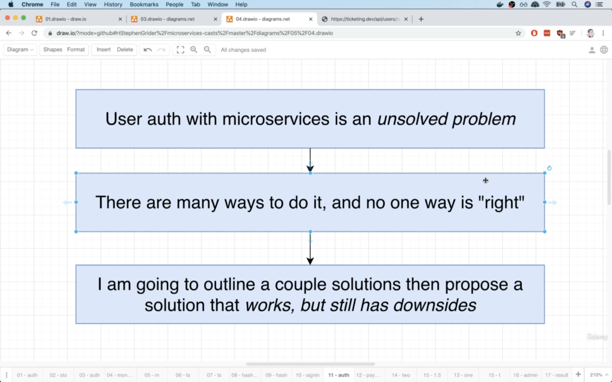
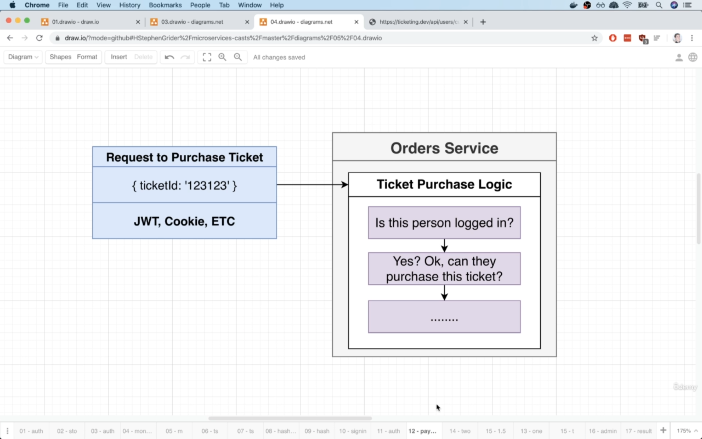
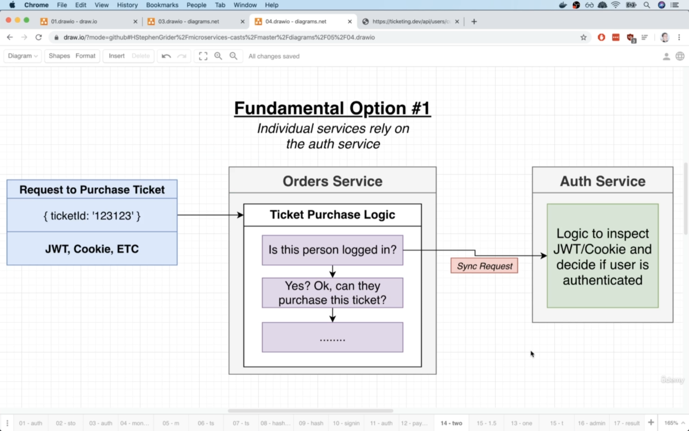
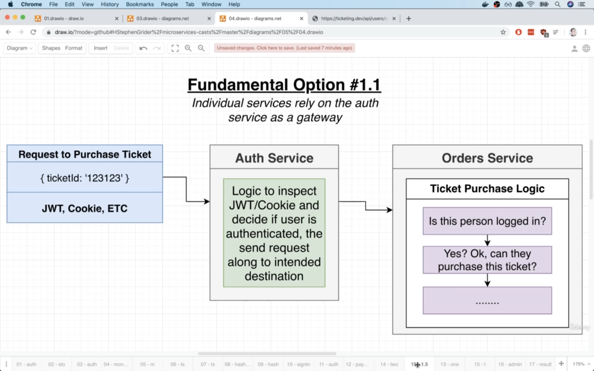
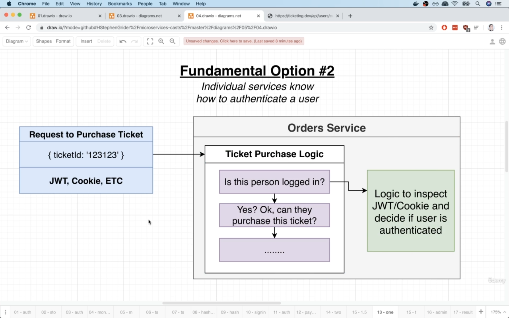
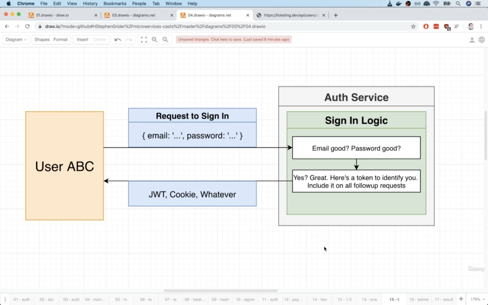
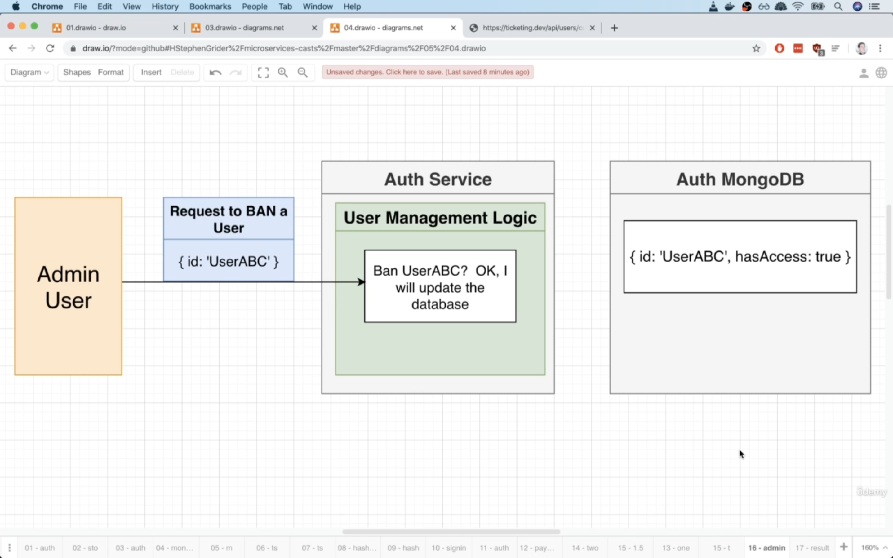
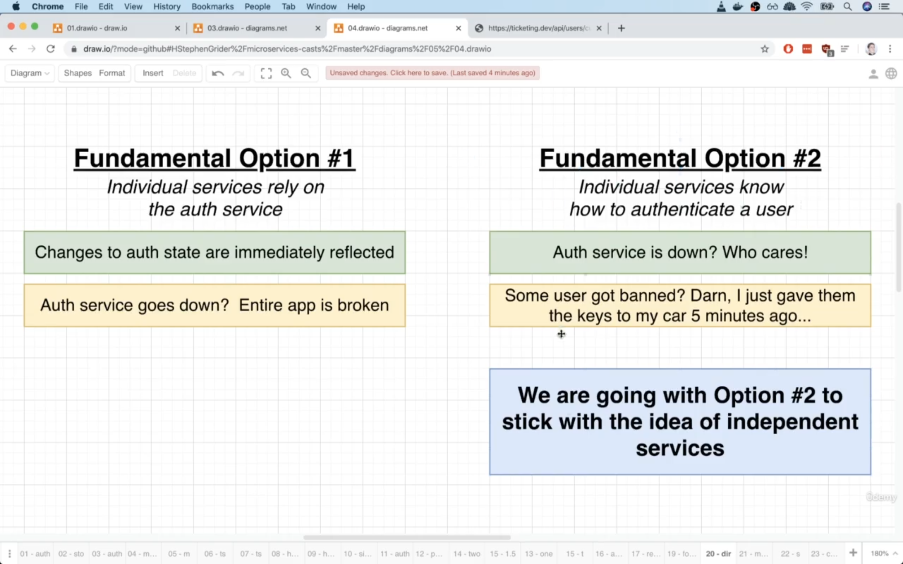

# 09 - Authentication Strategies and Options

## 163-001 Fundamental Authentication Strategies:
Handling authentication, handling the process of making sure that someone is sending this req to us, is logged into our app is challenging in microservices.

Handling user authentication, in other words, giving a user a cookie, a JSON web token or sth similar and allowing them to access other services inside
of our app is a challenging problem that is not really solved. In other words, there is not really a perfect solution to handling this stuff.

So instead, with microservices and in the context of this course, we're gonna try to outline a couple of approaches in handling authentication.

Approaches in how we can say: "Hey user, here's a cookie or here's a token. Give this to us in the future" and how we can decide whether or not a user truly is 
authenticated.

User authentication comes down to how we answer this question: How do we decide whether or not someone is logged-in in a microservices app?

There are 2 approaches for this:
The reason there is the word `fundamental` in pictures, is that there are variations of each of these approaches. All of the different strategies
out there really come down to 2 very funamental principles.

1) **option #1**: The idea is that we allow individual services to rely on some centralized authentication service to decide whether or not a user is logged in.
   The `sync request` in the img is related to world of microservices not the world of JS. In the world of microservices, sync req refers to a direct req
   from one service to another, one that does not make use of events or event busses or anything like that.
   So the downsides of fundamental option #1, really shares all the same downsides as synchronous communication in general. If we used this solution, think about
   what would happen if the auth service just mysteriously went down one day? If that thing crashed or just disappeared, all of a sudden, no one, no service
   inside of our entire app can decide if a person is logged in and that means that any req that requires us to decide if a person is authenticated, is 
   automatically going to fail!
2) **option #1.1(variation of #1)**: This option is very close to option #1 because we're still relying upon the auth service 100% of the time. With this, any req
   coming into our app, would need to go through some central gateway of sorts, that would authenticate the incoming req. For example, 
   whenever user makes a req to purchase a ticket, rather than going directly to the orders service, we would instead have it flow into some
   auth gateway or some auth service of sorts that would inspect that incoming req and decide if the user is authenticated. If they are, we would then
   send the req along to the intended destination, otherwise we would just reject it right away. This still shares a lot of pros and cons of option #1, because 
   we still have a 100% reliance on the authentication service in both cases. If this thing ever goes down, all of a sudden we cannot make a single req that
   requires any kind of authentication. 
3) **option #2**: We're gonna teach each individual service how to decide whether or not a user is authenticated. In this scenario, we have no dependency on 
   outside services, no dep on a gateway or some other service or anything like that. Everything is wrapped up inside of one single service and if a user
   ever makes a req to for example the orders service, we will immediately and instantly know whether or not this user is logged in.
   **Upside** is we do not have any outside dep.
   **Downside** is that we're gonna end up duplicating auth logic between all of our services. But the solution is we can move this auth logic into a shared library that's
   used among all of our services. But there are some much more larger critical downsides of this option. We'll see them in next vid.
   

approach #1:

approach #1.1:

approach #2:

## 164-002 Huge Issues with Authentication Strategies
In authentication solution #1, we had a reliance or dep on some central auth service(#1).

We took a look at a slight variation of that, where we had some central gateway that would block unauthenticated reqs(#1.1).

We also had another one(#2) where we're gonna teach each service how to authenticate an incoming req.

Let's say a user logged in to our app and got a JWT. Now after some time, we ban that user using the auth service which is decoupled from other
services of our microservice. But that user still has a valid jwt and he sends a req to some service in our microservice and that service doesn't 
care about auth service, it's decoupled from auth service. So even though the auth service is 100% certain that this user should not have access to
our entire app, at no point using option #2 do we ever go over to that service(auth) to figure out whether or not this person is authenticated.

That is the core issue with approach #2. Even though we get this fantastic separation of services, we don't have any deps, there are still going to be 
scenarios where we try to update data in one location tied to a user status, but all the other services are not going to hear about that update(like a user
just banned). They don't know. They don't have any logic to be told: Hey, this user is now banned or sth like that, because there's no direct connection between
the two.

So all this authentication stuff is a nasty thing. It is an unsolved problem. There's no single solution out there that is just the right way to do it.
We can try to figure out some clever ways to work around some of these restrictions.

We're gonna use a solution even though it still has some downsides.

## 165-003 So Which Option:
We looked at 2 options for handling the question: whether or not a user is authenticated inside of our app.

Option #1:
**pros**:
Anytime we made changes to our auth state or the access of a user, it would be immediately reflected throughout the **rest** of our services.
So if we said a user was banned, as soon as the next service came and asked about the status of a user or whether or not they were actually signed in, we could
absolutely say this person is banned, do not allow them to access.
But there is a downside too which is in image.

cons: in image

Option #2:
pros: In image
cons:
If some user ever got banned, there is going to be a window or a period of time where we were gonna continue to trust that that user was actually signed in.

In microservices, the async communication really leads to a huge amount of independence between our different services. But we can have a hybird of sorts.
We can have a set up where we've got a ton of async communication going on, but we can also have some little instances of sync communication as well.

For the problem with updating the authentication status of users(like banning them) which can also be a security issue as explained, we will solve it in the future.

## 166-004 Solving Issues with Option #2:
 
## 167-005 Reminder on Cookies vs JWT's:
